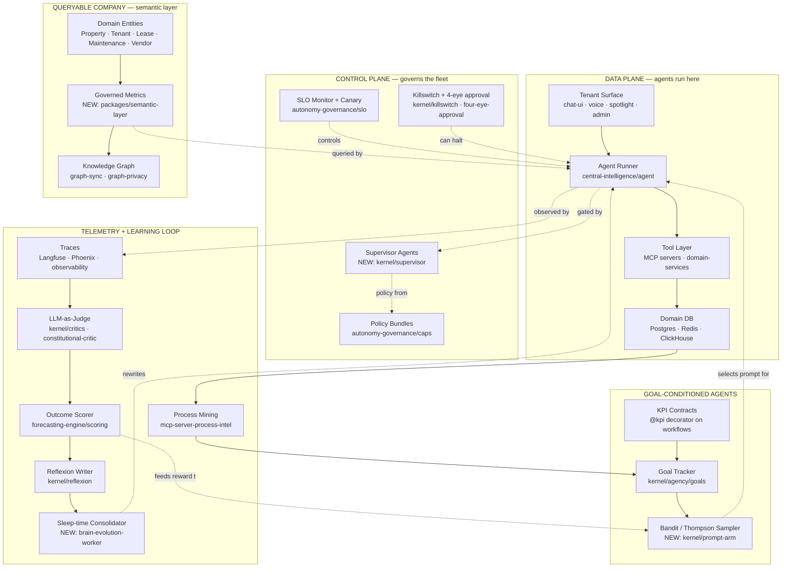

# Closed-Loop Company OS — SOTA 2026 Research

**Audit date**: 2026-05-23
**Target**: BOSSNYUMBA101 — multi-tenant property-management AI SaaS, repositioned as **the operating company that runs an entire PM business**, not a tool PM companies use.
**Thesis**: Every workflow flows through an intelligence layer that observes outputs, compares to goals, and self-corrects. Control plane + data plane. Goal-conditioned agents. Queryable company. Sleep-time consolidation. The company *is* the loop.

---

## 1. Closed-loop control theory applied to business processes

### (a) SOTA as of May 2026
Three converging paradigms:
- **OODA loops** (Boyd, 1976) reframed as the canonical agent-runtime: Observe (instrumented telemetry) → Orient (world-model + memory) → Decide (LLM + critics) → Act (tools/MCP) → re-Observe. The loop *is* the agent; pipelines that don't feed back are not agents.
- **PID-for-LLMs**: real-time tuning of agent behaviour via natural-language instructions — the agent reads a setpoint (KPI target), measures error, and adjusts parameters (prompt, model, tool selection). Demonstrated for servo-motor PID in 2025 and ported to enterprise workflows.
- **Self-stabilising harnesses**: 65% of enterprise AI failures trace back to *harness defects* (Context Drift, Schema Misalignment, State Degradation), not model failures. Stabilising the harness — checkpointing, retries, schema validation, drift detection — beats model swaps.

### (b) Concrete pattern
```
Observe   → telemetry bus (every action, latency, cost, outcome) → Langfuse/Phoenix/Helicone
Orient    → world-model + memory + KG join → "what is the current state of the company?"
Decide    → LLM + critic ensemble + policy guard → "what action moves us toward the goal?"
Act       → durable tool call via MCP → idempotent, retried, audited
Reflect   → sleep-time consolidation rewrites memory + updates prompts/tools
```

### (c) References
- [OODA loop for agents — Oracle](https://blogs.oracle.com/developers/what-is-the-ai-agent-loop-the-core-architecture-behind-autonomous-ai-systems)
- [LLM+PID control 2025 paper, MDPI Actuators](https://www.mdpi.com/2076-0825/14/9/459)
- [Agent Harness Engineering — A. Masood](https://medium.com/@adnanmasood/agent-harness-engineering-the-rise-of-the-ai-control-plane-938ead884b1d)

### (d) What BOSSNYUMBA must add
- A formal **`ControlLoop`** primitive (currently distributed across `kernel/agency`, `kernel/feedback`, `kernel/reflexion`). Wrap into one named abstraction in `packages/central-intelligence/src/kernel/control-loop/`.
- Setpoint binding: every workflow declares its KPI in code (e.g., `@kpi('time_to_lease_signed', target='<48h')`), wiring `central-intelligence/src/kernel/agency/goals/goal-tracker.ts` to actual workflow steps.

---

## 2. AI-native company OS reference architectures (May 2026)

### Decagon — AI Customer Experience platform (closed-loop)
- **Pattern**: **AOP (Agent Operating Procedure)** = NL spec that *compiles* to structured agent logic. Loop is: AOP Copilot drafts → Simulations regression-test against historical transcripts → Experiments live-A/B → Agent Versioning rolls back if CSAT/AHT degrades.
- **Closes the loop with**: production conversation analytics → AOP Copilot suggests refinements → re-tested → deployed. Raised $250M Series D at $4.5B (Mar 2026).
- **Adopt for BOSSNYUMBA**: model `central-intelligence/src/agent/system-prompt.ts` as a versioned AOP per tenant; bind to `packages/autonomy-governance/src/slo/canary-controller.ts` for traffic splits.
- Ref: [Decagon — AI Concierge](https://decagon.ai/), [Microsoft Startups — Decagon](https://www.microsoft.com/en-us/startups/blog/decagon-building-the-ai-concierge-for-modern-customer-experience/)

### Sierra — Constellation of Models + Supervisor pattern
- **Pattern**: 15+ models (frontier, open-weight, in-house) per agent; **supervisory agents** ("Jiminy Crickets") wrap each LLM with a different model, enforcing policies/guardrails/quality checks at runtime. $950M @ $15B (May 2026), $150M ARR in 8 quarters, ~40% of Fortune 50.
- **Adopt for BOSSNYUMBA**: ship a `SupervisorAgent` interface — different from a critic — that *interrupts* execution mid-tool-call. Slot into `packages/central-intelligence/src/kernel/critics/constitutional-critic.ts` and wire to `packages/autonomy-governance/src/caps/cap-evaluator.ts`.
- Ref: [Sierra — Constellation of Models](https://sierra.ai/blog/constellation-of-models)

### Glean — Work AI closed-loop knowledge graph
- **Pattern**: every agent run becomes a **trace edge** in the enterprise graph (tools called, order, inputs/outputs, success, efficiency, upvote/downvote). Graph learns from both humans and agents. Continuously evolves context.
- **Adopt for BOSSNYUMBA**: every action by central-intelligence agents must emit a trace into a graph node that links Property→Tenant→Lease→Maintenance→Vendor→Outcome. Extend `packages/graph-sync/` to record agent traces, not just data.
- Ref: [Glean — Agentic Reasoning](https://www.glean.com/blog/agentic-reasoning-future-ai), [Glean — Knowledge Graph](https://www.glean.com/blog/knowledge-graph-agentic-engine)

### Cresta — Agent Operations Center (closed-loop coaching)
- **Pattern**: unified command hub for *both* human and AI conversations; supervisors monitor live, guide toward better outcomes, intervene instantly. Coaching applies to both — the AI gets feedback and so do humans.
- **Adopt for BOSSNYUMBA**: `apps/admin` needs a "Live Ops" view of all in-flight agent conversations with takeover button. Slot under a new `apps/admin/src/routes/live-ops/` route group fed by realtime-rooms.
- Ref: [Cresta — Agent Operations Center](https://cresta.com/agent-operations-center)

### Maven AGI — Agent Designer
- **Pattern**: unified workspace for analytics + knowledge refinement + behaviour tuning + validation. 93% autonomous resolution claim. CX/Ops/Product all in one place.
- **Adopt**: collapse three internal places into one "Agent Studio" page in spotlight/admin.
- Ref: [Maven Agent Designer](https://www.mavenagi.com/product/agent-designer)

### Reflexion / Voyager / SWE-agent / DGM / Live-SWE-Agent — self-improving
- **Pattern**: define eval metric → run loop → let the system find optimisations a human would miss. DGM went from 20%→50% on SWE-bench autonomously. Databricks reported **90× cost reduction with GEPA**. Live-SWE-agent self-evolves on-the-fly during runtime.
- **Adopt for BOSSNYUMBA**: extend `packages/forecasting-engine/src/feedback/reflexion-update.ts` from forecasting-only to *all* agent surfaces (maintenance triage, screening, voice). Add a nightly GEPA-style prompt-optimisation job for top-traffic surfaces.
- Ref: [Live-SWE-agent paper](https://arxiv.org/pdf/2511.13646), [Self-Improving AI Agents 2026 Guide](https://o-mega.ai/articles/self-improving-ai-agents-the-2026-guide)

### Linear MCP-native PM (Feb 2026 update)
- **Pattern**: Linear *is* the agent's working memory. One prompt → pulls evidence, cross-references analytics, creates Linear issue, updates a doc. Linear MCP server added initiatives/milestones/updates in Feb 2026. AI treats Linear as system-of-record, not a destination to manually sync to.
- **Adopt for BOSSNYUMBA**: BOSSNYUMBA's `cases` + `approvals` should *be* the agent's task tracker via MCP — agents read/write cases directly. Extend `packages/mcp-server/` and `services/mcp-server-process-intel/` to expose case-mutation tools.
- Ref: [Linear MCP Feb 2026 changelog](https://linear.app/changelog/2026-02-05-linear-mcp-for-product-management)

### Anthropic Claude Managed Agents — "Dreaming" (May 6, 2026)
- **Pattern**: scheduled background process reviews recent sessions + memory, identifies recurring mistakes, writes consolidated notes back into long-term memory. **Harvey reported 6× task-completion lift** on long-form legal drafting after enabling dreaming.
- **Adopt for BOSSNYUMBA**: this is *the most important pattern* — implement a nightly `BrainConsolidator` worker that re-reads day's traces and rewrites prompt-stable memory blocks. Extend `services/domain-services/src/intelligence/intelligence-history-worker.ts` to do consolidation, not just history-write.
- Ref: [Claude Managed Agents — dreaming](https://aiautomationglobal.com/blog/claude-managed-agents-dreaming-outcomes-multiagent-2026)

---

## 3. The "Queryable Company" pattern

### (a) SOTA
Universal semantic layer is now **production infrastructure**, not a nice-to-have. **Open Semantic Interchange (OSI)** finalised Jan 2026 by Snowflake + ecosystem — agents built on one platform consume semantic context from another without custom integration. AtScale, Atlan, Strategy Mosaic, Fluree, Promethium are the reference vendors. Microsoft Fabric IQ frames the problem: "enterprise AI agents keep operating from different versions of reality."

### (b) Pattern
1. Calls recorded + transcribed (Twilio/AssemblyAI/Deepgram).
2. Tickets/cases tagged with structured taxonomy.
3. Meetings transcribed and chunked.
4. **One semantic layer** maps `Property`, `Tenant`, `Lease`, `Maintenance`, `Vendor`, `Invoice`, `Inspection` as first-class entities with governed metrics.
5. Every agent + every dashboard queries the *same* layer.

### (c) References
- [Open Semantic Interchange — Atlan + Snowflake](https://atlan.com/snowflake-open-semantic-interchange-launch-partner/)
- [Strategy Mosaic universal semantic layer](https://www.strategy.com/software/blog/semantic-layer-for-enterprise-ai-in-2026-what-production-use-requires)
- [Microsoft Fabric IQ — same version of reality](https://venturebeat.com/data/enterprise-ai-agents-keep-operating-from-different-versions-of-reality)

### (d) What BOSSNYUMBA must add
- BOSSNYUMBA has `packages/domain-models/` and `packages/graph-sync/` — extend with **`packages/semantic-layer/`** that publishes the canonical metric definitions (occupancy rate, NOI, MTTR-maintenance, lease-velocity, vendor-quality-score). All agents + all dashboards query this — never raw SQL against domain-services.
- Adopt OSI v1 export so future BI/agents (Snowflake Cortex, Glean) can consume BOSSNYUMBA semantics natively.

---

## 4. OSS frameworks for closed loops

### LangGraph 1.2 (May 11, 2026)
- **SOTA**: durable graph executions (not Python function calls); checkpointers (Memory/SQLite/Postgres) save state between *nodes* (not inside); pause/resume/time-travel/multi-instance HA first-class. Klarna, LinkedIn, Uber, Replit in production.
- **Catch**: checkpointers save *between* nodes — if a long loop inside one node crashes, intermediate work is lost. Keep nodes short.
- Ref: [LangGraph 1.2 vs Temporal 2026](https://agentmarketcap.ai/blog/2026/04/08/langgraph-vs-temporal-long-running-agent-workflows-2026)

### Temporal (Feb 2026: $300M @ $5B)
- **SOTA**: durable execution decouples workflow from workers; every event in workflow history is recorded; recovery is automatic. NVIDIA orchestrates GPU workflows; Gorgias + ZoomInfo run agent apps on it.
- **When to pick over LangGraph**: agent runs days/weeks, exactly-once semantics critical, polyglot worker fleet.
- Ref: [Temporal — Durable AI Agents](https://temporal.io/pages/durable-ai-agent-bundle)

### Inngest + AgentKit
- **Pattern**: event-driven durable workflows, multi-agent networks in TypeScript with deterministic routing, native MCP. AI-Agent Harnessing is the 2026 narrative — durable execution makes probabilistic LLMs production-grade.
- Ref: [Inngest — Durable Execution for AI Agents](https://www.inngest.com/blog/durable-execution-key-to-harnessing-ai-agents)

### Dagster / Prefect / Restate / Cadence
- **Dagster** = asset-centric (data assets as first-class entities; ideal for "the property dataset" or "the tenant dataset").
- **Prefect** = Python-first developer experience.
- **Restate** = low-latency durable execution (where Temporal latency hurts).
- **Cadence** = Temporal's predecessor; Uber-built.
- Ref: [Orchestra blog — Airflow vs Dagster vs Prefect 2026](https://www.getorchestra.io/blog/dagster-vs-prefect-vs-airflow-complete-data-orchestration-comparison-2026)

### CrewAI
- **Pattern**: `@persist()` decorator auto-saves workflow state; persistent cognitive memory across sessions; train agents with human feedback; Flows + Crews dual layer.
- Ref: [CrewAI Multi-Agent Platform](https://crewai.com/)

---

## 5. Sprint-cut / cycle-time case studies (concrete numbers)

| Org | Workflow | Result | Source |
|---|---|---|---|
| **Klarna** | Customer support | 2.3M chats in month 1, 2/3 conversations automated, resolution time 11→2 min (~82% drop), $40M/yr cost avoidance (was hiring-avoidance, not layoffs — and they later re-hired humans for complex cases) | [Twig — Klarna AI breakdown](https://www.twig.so/blog/klarna-ai-customer-support-efficiency) |
| **Atlassian** | PR code reviews | **45% PR cycle-time cut** with AI reviewers (ICSE 2026) | [Atlassian — How we cut PR cycle time](https://www.atlassian.com/blog/announcements/how-we-cut-pr-cycle-time-with-ai-code-reviews) |
| **Harvey** (Anthropic Managed Agents) | Long-form legal drafting | **6× task completion** after enabling "dreaming" (May 2026) | [Anthropic dreaming launch](https://aiautomationglobal.com/blog/claude-managed-agents-dreaming-outcomes-multiagent-2026) |
| **Mezo (PM)** | Maintenance triage | **30% faster work order resolution** | [Showdigs — Best AI PM tools 2026](https://www.showdigs.com/property-managers/the-best-ai-powered-property-management-tools) |
| **Credia / Re-Leased** | Document operations | Maintenance request 5 min → 30 sec; lease data entry weeks → hours | [Re-Leased — Credia AI](https://www.re-leased.com/artificial-intelligence) |
| **Databricks (GEPA)** | Prompt optimisation | **90× cost reduction** | [Morphllm — Self-Improving AI](https://www.morphllm.com/self-improving-ai) |
| **DGM** (research) | SWE-bench | 20% → 50% resolve rate via autonomous self-modification | same source |
| **Valorant (procurement)** | Procurement | 40% cycle-time cut | [LinkedIn case study](https://www.linkedin.com/posts/valorant_case-study-how-we-cut-procurement-cycle-activity-7378432720466632704-0rCN) |
| **Ability.ai customers** | Generic ops via closed-loop AI middleware | **Sprint times cut in half** | [Ability.ai blog](https://www.ability.ai/blog/closed-loop-ai-systems-middleware) |

**Implication for BOSSNYUMBA**: a *credible* internal target is 30–50% reduction in time-to-lease, time-to-maintenance-close, and time-to-vendor-pay within 12 months of closed-loop activation.

---

## 6. Control plane patterns for fleets of agents

### (a) SOTA
The **AI Control Plane** is the 2026 buzzword. Data plane = where agents run tasks. Control plane = governs deploy, monitor, route, policy, kill-switch. 65% of enterprise AI failures are *harness defects* (context drift, schema misalignment, state degradation). 40% of enterprise apps will have task-specific AI agents by end of 2026 (vs <5% in 2025) → fleet-sized governance is unavoidable.

### (b) Reference vendors
- **BentoML** — Python-first model packaging (open-source).
- **Modal** — serverless Python+GPU; minimal infra.
- **Anyscale + RayServe** — distributed scheduling, multi-node tensor-parallel for 70B models.
- **Northflank / Baseten / Truefoundry** — newer PaaS fleet control.
- **IBM watsonx Agent Control Plane** — enterprise reference.
- **Google Agent Engine (Vertex)** — control + deploy for ADK agents.
- Ref: [Truefoundry — What Is AI Control Plane](https://www.truefoundry.com/blog/what-is-ai-control-plane), [IBM — Agent Control Plane](https://www.ibm.com/think/topics/agent-control-plane), [The New Stack — Why agentic AI stalls in production](https://thenewstack.io/agentic-ai-control-plane-production/)

### (c) What BOSSNYUMBA already has
- `packages/autonomy-governance/` — caps/SLO/canary-controller/auto-rollback (good).
- `packages/observability/` — event-bus + audit-logger + tracing + sentry (good).
- `packages/central-intelligence/src/kernel/killswitch.ts` (good).

### (d) What BOSSNYUMBA must add
- A **fleet view** in admin: every agent instance × tenant × surface × version × SLO compliance. Roll up to a single "Brain Health" page.
- **Per-tenant policy bundles** that the control plane pushes (currently scattered).

---

## 7. Feedback collection / telemetry (production stack)

### (a) SOTA stack picks
- **Langfuse** (MIT, self-host, **acquired by Clickhouse Jan 2026**) — full traces of LLM calls + tools + retrievals; flexible evals; OTel-compatible. *Default choice for self-host.*
- **LangSmith** — zero-config tracing for LangChain stack, but vendor lock-in + exponential per-trace pricing.
- **Braintrust** — best for eval-blocking-deploy CI/CD discipline.
- **Helicone** — simplest proxy; OpenAI-centric; cheap.
- **Arize Phoenix** (OSS) — embedded clustering, drift detection, OpenTelemetry-native.
- **Galileo** — Luna-2 evaluators (fast, cheap) for production monitoring at scale.
- **Comet Opik** — auto prompt+tool optimisation, broadest framework ecosystem.
- **PostHog AI** — closed signals loop: errors/recordings/experiments + Slack/support tickets → ML enriches → coding agents create PRs → humans review → ship → new signals.

### (b) Pattern (the *closed-loop* one)
```
Trace (Langfuse) → Score (LLM-as-judge / human label) → Dataset → Eval (Braintrust)
        ↓                                                              ↓
   Drift alarm (Phoenix)                                         Prompt-tuning job (GEPA)
        ↓                                                              ↓
   Reroute via control plane                                 Push new prompt version
        ↓                                                              ↓
        ←———————————————— back into production traces ——————————————→
```

### (c) References
- [Appscale — Langfuse vs LangSmith vs Braintrust vs Helicone 2026](https://appscale.blog/en/blog/langfuse-vs-langsmith-vs-braintrust-vs-helicone-2026)
- [Braintrust — Best AI Observability Tools 2026](https://www.braintrust.dev/articles/best-ai-observability-tools-2026)
- [PostHog AI handbook](https://posthog.com/handbook/engineering/ai/ai-platform)

### (d) BOSSNYUMBA gap
- BOSSNYUMBA has `packages/observability/` and `packages/central-intelligence/src/kernel/__tests__/eval/` — but **no online evaluator on production traffic**. Add Langfuse self-host + Phoenix OSS as the *runtime* telemetry path; reserve the in-house eval harness for offline regression.

---

## 8. Goal-conditioned agents (KPI-aware, self-adjusting)

### (a) SOTA
- **KPI-led AI adoption** is the named 2026 trend. Organisations begin with specific outcomes, tie them to measurable KPIs, then build agents *to that target*. "AI Agent Optimization" is now a discipline (tuning routing, tool use, context, guardrails under real production conditions).
- **GRPO** (Group Relative Policy Optimization) is the leading RFT algorithm (DeepSeek-R1 used it). Combined with **RULER**, allows agents to improve through experience without writing reward functions or labels.
- **Reflexion + GEPA + Live-SWE-agent** = the deployable subset (no special infra; just LLM API + memory store + eval fn).
- **Contextual bandits + Thompson sampling** for prompt selection: production-ready for A/B/n choice between prompts, models, tool variants. 2026 advances: PFN-TS (Prior-Data Fitted Networks), BFTS (Bayesian Forests).

### (b) Pattern
1. Every workflow declares its KPI in a typed contract (`@kpi('time_to_close', target='<48h', tolerance='2h')`).
2. Outcome score recorded per run (already exists in `packages/forecasting-engine/src/scoring/outcome-scorer.ts`).
3. A multi-armed bandit selects prompt/model/tool variant per run; Thompson posterior updates daily.
4. Below-tolerance runs feed Reflexion which writes a delta to the next prompt.
5. Nightly GEPA job evolves the prompt across the past 24h.

### (c) References
- [Fin.ai — AI Agent KPIs Enterprise Framework](https://fin.ai/learn/ai-agent-kpis-enterprise-performance-metrics-framework)
- [JADA — AI Agent Optimization 2026 Guide](https://www.jadasquad.com/blog/ai-agent-optimization)
- [PFN-TS paper](https://arxiv.org/html/2605.10137v1)
- [DailyDoseOfDS — Fine-tune in 2026 (GRPO+RULER)](https://blog.dailydoseofds.com/p/how-to-fine-tune-llms-in-2026)

### (d) BOSSNYUMBA gap
- Have: `kernel/agency/goals/goal-tracker.ts`, `forecasting-engine/src/scoring/outcome-scorer.ts`, `forecasting-engine/src/feedback/reflexion-update.ts`.
- Missing: (i) machine-readable `@kpi` decorator on workflow contracts in `packages/api-sdk`; (ii) a Thompson-sampling **PromptArm** registry in `central-intelligence/src/kernel/sub-mds/`; (iii) nightly GEPA evolution job in a new `services/brain-evolution-worker/`.

---

## 9. Process mining + AI

### (a) SOTA
- **Celonis** still leads (created the category); EMS now AI-enhanced with predictive analytics + recommendations. *Limitation*: system-log focus — limited visibility into human work between transactions.
- **Apromore / IBM Process Mining / KYP.ai** — strong alternatives; KYP.ai positions as task-mining + process-mining hybrid.
- **AI uplift**: LLMs ingest event logs and *name* hidden processes the team didn't know existed; combine with task mining for desktop-app visibility.

### (b) BOSSNYUMBA cross-reference
- **Already has** `services/mcp-server-process-intel/` — this is *exactly* the right plumbing. Use it to: (i) ingest `audit_logs` from `services/domain-services/src/audit/`; (ii) run process-discovery on `services/payments-ledger` and `services/notifications` event streams; (iii) surface bottlenecks (e.g., "vendor approval averages 4.2 days because manager step waits 3.1 days").

### (c) References
- [Celonis — AI process discovery](https://www.celonis.com/blog/ai-process-discovery)
- [KYP.ai — Best automated process discovery 2026](https://kyp.ai/automated-process-discovery-tools/)

### (d) Missing
- A **process-mining-as-feedback** loop: discovered bottleneck → automatically generate a new agent surface to attack it → run for 7 days → re-mine → measure delta. Wire process-intel discoveries into `central-intelligence/src/kernel/agency/initiative/wake-loop.ts` so the brain *spawns its own work* against discovered bottlenecks.

---

## 10. The "company brain" thesis — AI-native ops orgs

### (a) Reference companies
- **Decagon** ($4.5B, AI Customer Experience) — AOPs + Simulations + Experiments + Versioning is the closed loop.
- **Sierra** ($15B, May 2026) — constellation of 15+ models + supervisor "Jiminy Crickets" wrapping every LLM.
- **11x** ($76M raised) — AI digital workers for sales/RevOps; multilingual, 24/7.
- **Cognition** — Devin (autonomous SWE); referenced as a likely first agent-pricing public listing.
- **Crew** (CrewAI) — multi-agent framework (50K+ stars); Flows + Crews + persistent memory.
- **Harvey** — legal AI; reference customer for Anthropic dreaming (6× lift on long-form drafting).

### (b) The common architecture
1. **Specs as code** — instructions are versioned artefacts that *compile* to agent behaviour (Decagon AOP, Anthropic SKILL.md, OpenAI Spec).
2. **Constellation, not one model** — different models for different stages (router, drafter, critic, supervisor, retriever, embedder).
3. **Supervisors at runtime** — separate model class wraps every primary LLM call to enforce policy.
4. **Sleep-time consolidation** — nightly memory rewrite (dreaming, sleep-time compute).
5. **Closed loop on production traces** — every run is a training signal, not just a log line.
6. **Human-in-loop for high-stakes** — Klarna's reversal shows the danger of pure-autonomy.

### (c) Klarna's lesson (negative)
- Klarna walked back AI-only customer service in 2025 after CSAT degraded on complex cases. **Re-introduced humans for high-complexity tickets**; **tightened AI confidence thresholds**. The closed loop must *include* the human handoff trigger as a first-class control.
- Ref: [Tech.co — Klarna reverses AI overhaul](https://tech.co/news/klarna-reverses-ai-overhaul)

---

## Reference architecture diagram



---

## 10 concrete patterns to apply to BOSSNYUMBA (with file paths)

| # | Pattern | Slot into BOSSNYUMBA at | Priority |
|---|---|---|---|
| 1 | **Sleep-time consolidation (Anthropic dreaming, Letta sleep-time compute)** — nightly worker re-reads day's traces and rewrites memory blocks | NEW: `services/brain-evolution-worker/` + extend `services/domain-services/src/intelligence/intelligence-history-worker.ts` | **P0** |
| 2 | **Supervisor agents (Sierra Jiminy Crickets)** — separate model class wraps every primary LLM call; policy-enforcement layer | NEW: `packages/central-intelligence/src/kernel/supervisor/` wired through `packages/autonomy-governance/src/caps/cap-evaluator.ts` | **P0** |
| 3 | **AOP (Agent Operating Procedure) versioning + simulations + experiments (Decagon)** — every prompt is a versioned spec with regression suite | Extend `packages/central-intelligence/src/agent/` to a `aops/` registry; use `packages/autonomy-governance/src/slo/canary-controller.ts` for traffic split | **P0** |
| 4 | **Semantic layer (Atlan/AtScale/OSI)** — one place defines NOI, occupancy, MTTR, lease velocity, vendor quality | NEW: `packages/semantic-layer/` consumed by all agents + dashboards; integrates with `packages/domain-models/` + `packages/graph-sync/` | **P1** |
| 5 | **Goal-conditioned KPI contracts (@kpi decorator)** — every workflow declares its KPI; runtime checks setpoint vs actual | Extend `packages/api-sdk/src/types.ts` with `@kpi` metadata; runtime check in `services/api-gateway/` middleware | **P1** |
| 6 | **Thompson-sampling prompt arms** — bandit selects prompt/model/tool variant; posterior updates daily | NEW: `packages/central-intelligence/src/kernel/prompt-arm/` reading rewards from `forecasting-engine/src/scoring/outcome-scorer.ts` | **P1** |
| 7 | **Process mining → spawn agent (Celonis-style)** — bottleneck discovered in `audit_logs` automatically creates an agent surface to attack | Wire `services/mcp-server-process-intel/` outputs into `packages/central-intelligence/src/kernel/agency/initiative/wake-loop.ts` | **P2** |
| 8 | **Cresta Agent Operations Center** — live ops view of all in-flight conversations with takeover button | NEW: `apps/admin/src/routes/live-ops/` fed by `packages/realtime-rooms/` + `packages/observability/` event bus | **P2** |
| 9 | **Glean trace-edge knowledge graph** — every agent run becomes a graph edge linking entities + outcome + feedback | Extend `packages/graph-sync/` to ingest agent traces, not just data mutations | **P2** |
| 10 | **Langfuse online evaluator + GEPA nightly prompt-tune** — self-host Langfuse for runtime traces; GEPA-style nightly evolution job | Add Langfuse to `services/observability` stack; new `services/prompt-evolution-worker/` runs GEPA on prior 24h traffic | **P2** |

---

## What BOSSNYUMBA already has (strong foundation — better than most public companies)

Cross-referenced from `packages/` and `services/`:

| Capability | Where |
|---|---|
| Brain kernel with critics, debate, reflexion, world-model | `packages/central-intelligence/src/kernel/{critics,debate,reflexion,world-model}/` |
| Goal-tracking + plan decomposition | `packages/central-intelligence/src/kernel/agency/goals/` |
| Initiative / wake-triggers / stall-detector (agent self-spawns work) | `packages/central-intelligence/src/kernel/agency/{initiative,wake-triggers,stall-detector.ts}` |
| Counter-model + shadow-mode + persona-drift detection | `packages/central-intelligence/src/kernel/{counter-model,shadow-mode,persona-drift}/` |
| Continuous grading + drift detector + cohort signal | `packages/central-intelligence/src/kernel/{continuous-grading,drift-detector,cohort-signal}.ts` |
| 4-eye approval + killswitch + inviolable rules | `packages/central-intelligence/src/kernel/{four-eye-approval,killswitch,inviolable}.ts` |
| Metacognition (autobiography, activation probe, defection probe) | `packages/central-intelligence/src/kernel/metacognition/` |
| CoT reservoir | `packages/central-intelligence/src/kernel/cot-reservoir/` |
| Caps + SLO monitor + auto-rollback + canary | `packages/autonomy-governance/src/{caps,slo}/` |
| Tenant autonomy cap | `packages/autonomy-governance/src/caps/tenant-autonomy-cap.ts` |
| Observability (event bus, audit, tracing, sentry, security wrappers) | `packages/observability/src/` |
| Process intelligence MCP server | `services/mcp-server-process-intel/` |
| World-model with business-archetype, cashflow-state, compliance-state | `packages/forecasting-engine/src/world-model/` |
| Predicted-vs-actual feedback + reflexion-update | `packages/forecasting-engine/src/feedback/` |
| Sandbox + parallel-run + diff-view-renderer | `packages/forecasting-engine/src/sandbox/` |
| Outcome scorer + Pareto frontier + owner-intent | `packages/forecasting-engine/src/scoring/` |
| Maintenance-triage agent | `packages/central-intelligence/src/maintenance-triage/` |
| Credit-scoring + screening | `packages/central-intelligence/src/{credit-scoring,screening}/` |
| Agent platform with agent-card, agent-auth, webhook-delivery, idempotency, correlation-id, error-codes | `packages/agent-platform/src/` |
| Conversation audit reader | `packages/central-intelligence/src/audit/` |
| Intelligence history worker | `services/domain-services/src/intelligence/intelligence-history-worker.ts` |
| Feedback memory repositories | `services/domain-services/src/feedback/memory-repositories.ts` |
| Predictive scheduler | `services/domain-services/src/maintenance/predictive-scheduler.ts` |
| Realtime rooms (for live takeover) | `packages/realtime-rooms/` |
| GenUI for agent surfaces | `packages/genui/` |
| MCP server + connectors + LPMS connector | `packages/{mcp-server,connectors,lpms-connector}/` |
| Compliance plugins | `packages/compliance-plugins/` |
| Graph privacy + graph sync | `packages/{graph-privacy,graph-sync}/` |

**Verdict**: BOSSNYUMBA is ahead of most named SOTA vendors on raw component coverage. The gap is **synthesis** — wiring these into a single named "ControlLoop + Supervisor + AOP + Semantic-Layer + Sleep-Time" architecture, plus the **runtime online evaluation + bandit-based prompt selection + nightly GEPA**.

---

## What's missing (prioritised)

### P0 — ship in next 30 days
1. **Sleep-time consolidator worker** (`services/brain-evolution-worker/`) — Anthropic dreaming pattern. Single biggest win; Harvey reported 6×.
2. **Supervisor-agent layer** (`packages/central-intelligence/src/kernel/supervisor/`) — Sierra Jiminy-Cricket pattern. Wraps every primary LLM call.
3. **Versioned AOP registry** with simulations + experiments + rollback. Decagon pattern. Bind to existing `canary-controller.ts`.

### P1 — ship in next 60 days
4. **`packages/semantic-layer/`** — single source of truth for company-wide metrics; consumed by all agents + dashboards.
5. **`@kpi` workflow contracts** in `packages/api-sdk` — every workflow declares its KPI; runtime checks setpoint.
6. **Thompson-sampling `PromptArm` registry** — multi-armed bandit selects best prompt/model variant per run.

### P2 — ship in next 90 days
7. **Process-mining → agent-spawn loop** — feed `mcp-server-process-intel` discoveries into `wake-loop.ts`.
8. **Live Ops view** (`apps/admin/src/routes/live-ops/`) — Cresta-style supervisor console.
9. **Trace-edge knowledge graph** — every agent run is a graph edge in `packages/graph-sync/`.
10. **Langfuse + GEPA online learning loop** — runtime evals + nightly prompt evolution.

### Cross-cutting
- Adopt **Open Semantic Interchange (OSI) v1** export from `packages/semantic-layer/` so external agents (Snowflake Cortex, Glean, Atlan) can consume BOSSNYUMBA semantics natively.
- Establish **harness defect** metrics (context drift %, schema misalignment %, state degradation %) as first-class SLOs in `packages/autonomy-governance/src/slo/`.
- **Klarna-lesson tripwire**: every agent surface ships with a confidence-threshold gate; under-threshold runs auto-route to human; CSAT drop > X% pauses the surface.

---

## Closing thesis

BOSSNYUMBA already has **more closed-loop primitives than Decagon, Sierra, or Glean's public architectures suggest they have** (counter-model, persona-drift, defection-probe, cohort-signal, killswitch, four-eye-approval, continuous-grading are not standard in named SOTA vendors).

The strategic move is not to add more primitives. It is to **name and wire** what exists into a single **"ControlLoop"** architecture, then add the *three* missing things that compound dramatically:

1. **Sleep-time consolidator** (6× task-completion uplift, evidenced).
2. **Supervisor agents** (Sierra's $15B moat).
3. **AOP versioning + simulations + experiments** (Decagon's $4.5B moat).

With those three plus the existing kernel, BOSSNYUMBA *is* the closed-loop company OS for property management — not a tool, the operator.
