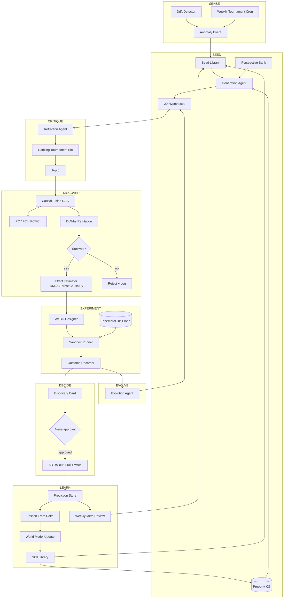

# Scientific Discovery & Causal AI — SOTA 2026 Research

**Audit date:** 2026-05-23
**Author:** Research agent, BOSSNYUMBA LITFIN cycle
**Scope:** Frontier "AI scientist", causal-discovery, hypothesis-generation, experiment-design and knowledge-graph reasoning systems suitable for a continuous-discovery "Scientific Discovery" tab inside the multi-tenant property-management portal.
**Target consumer:** Internal admin / VP-of-Intelligence persona of `apps/admin-portal` plus tenant-facing summaries surfaced via `packages/central-intelligence` and `packages/ai-copilot`.

---

## 0. Why this matters for BOSSNYUMBA

A multi-tenant PMS sits on the world's richest causal substrate for property economics:

- Per-unit rent ledger, vacancy spans, lease churn, maintenance tickets, vendor invoices, utility curves.
- Per-tenant payment cadence (M-Pesa, bank, cash), income proxies, eviction events.
- Per-district market signals (Bayut/PropertyPro/local-MLS comparables, transit, schools, crime).
- Per-property amenity vectors (gym, parking, fibre, security), management style, owner archetype.

What we **lack** today is an autonomous *dot-connector* that continuously hunts for non-obvious causal drivers ("why is District X vacancy 18% vs city 7%? does adding gym change collection rate? which rent thresholds correlate with eviction? is M-Pesa-vs-cash linked to default risk?"). A "Scientific Discovery" tab does for property economics what AI Co-Scientist does for biomedicine.

---

## 1. Frontier AI scientist systems — what they are, May 2026

### 1.1 Google AI Co-Scientist (Gemini 2.0)

- **What it is:** Multi-agent virtual scientific collaborator (Gemini 2.0) for hypothesis generation. Published in *Nature*; launched as **"Hypothesis Generation"** experimental tool via Google DeepMind / Google Cloud / Google Labs.
- **Approach — "Generate, debate, evolve":** Six specialised agents — **Generation**, **Reflection**, **Ranking**, **Evolution**, **Proximity**, **Meta-review** — iteratively propose hypotheses, peer-review them, run an "idea tournament" (pairwise comparisons + simulated scientific debate) to prioritise, then mutate winners. Test-time compute is *scaled* (think tree-of-thought + LLM-as-judge tournaments).
- **Ref:** [DeepMind blog — Co-Scientist](https://deepmind.google/blog/co-scientist-a-multi-agent-ai-partner-to-accelerate-research/), [Google Research blog](https://research.google/blog/accelerating-scientific-breakthroughs-with-an-ai-co-scientist/).
- **What BOSSNYUMBA needs to build:** Port the **Generation / Reflection / Ranking / Evolution / Meta-review** roster into `packages/scientific-discovery/src/co-scientist/` as **PortfolioGenerationAgent**, **CausalCritic**, **EvidenceRanker**, **HypothesisEvolver**, **WeeklyMetaReview**. Re-use the existing `central-intelligence/kernel/debate/` infrastructure (already a multi-critic debate loop).

### 1.2 Sakana AI Scientist v2 — Workshop-level autonomous discovery via agentic tree search

- **What it is:** End-to-end agentic system that autonomously *generates hypothesis → designs experiment → writes & runs code → writes paper*. Released Apr 2025. **One v2-produced paper passed ICLR 2025 peer review.**
- **Approach:** **Best-First Tree Search (BFTS)** — explores the research space in parallel; abandons failing branches early; concentrates compute on promising sub-trees. No human-authored templates (unlike v1). Adds **VLM feedback loop** to critique its own figures.
- **Ref:** [arXiv 2504.08066](https://arxiv.org/abs/2504.08066), [GitHub SakanaAI/AI-Scientist-v2](https://github.com/sakanaai/ai-scientist-v2).
- **What BOSSNYUMBA needs to build:** A **`DiscoveryTreeSearch`** runtime inside `packages/scientific-discovery` that lets a hypothesis-tree grow with BFTS over the existing `forecasting-engine/sandbox` (we already have safe DB-clone sandboxes — perfect substrate). Each node = (hypothesis, dataset slice, model, evidence, score). Prune by `f(novelty, statistical-power, business-relevance)`.

### 1.3 Stanford STORM + Co-STORM

- **What it is:** STORM = Synthesis of Topic Outlines through Retrieval & Multi-perspective question asking. **Co-STORM** = collaborative discourse protocol with multiple LLM experts + a *Moderator* that injects thought-provoking questions from retriever surprises.
- **Approach:** (1) **Perspective-guided question asking** — survey adjacent topics to discover *roles* (urban planner, micro-lender, anti-fraud auditor) and ask follow-ups *through their eyes*. (2) **Simulated conversation** between a writer-agent and an expert-agent grounded in cited sources.
- **Ref:** [GitHub stanford-oval/storm](https://github.com/stanford-oval/storm), [STORM project page](https://storm-project.stanford.edu/research/storm/).
- **What BOSSNYUMBA needs to build:** A **`PerspectiveBank`** of property-mgmt personas (Owner, Tenant, Vendor, Caretaker, Auditor, Regulator, Underwriter, Diaspora-Investor) that drive question-generation when investigating an anomaly. Already partly built — `central-intelligence/kernel/vp-personas/` and `theory-of-mind.ts` are the seed.

### 1.4 DeepMind FunSearch / AlphaEvolve

- **What it is:** **FunSearch** — evolutionary LLM-guided search over *programs* (Python functions). Discovers new mathematical results (cap-set, bin-packing) by mutating a population of code snippets, scored by an automatic evaluator. **AlphaEvolve** (May 2025) generalises it: optimises data-centre packing, speeds up Gemini training, rediscovers/improves classical algorithms.
- **Approach:** Population pool → LLM proposes mutations → automatic evaluator scores → island-model diversity preserved → best programs re-fed.
- **Ref:** [DeepMind FunSearch blog](https://deepmind.google/discover/blog/funsearch-making-new-discoveries-in-mathematical-sciences-using-large-language-models/), [GitHub google-deepmind/funsearch](https://github.com/google-deepmind/funsearch).
- **What BOSSNYUMBA needs to build:** **`PolicySearch`** — an evolutionary search over **pricing-policy** and **vendor-rotation-policy** snippets (TypeScript pure functions). Evaluator = sandboxed simulation in `forecasting-engine`. This is FunSearch but for *rent rules* and *operational SOPs*, not maths.

### 1.5 DeepMind AlphaProof / AlphaGeometry

- **What it is:** AlphaProof = RL-based formal-math reasoner (Lean). AlphaGeometry 2 = neuro-symbolic geometry solver. Together solved 4/6 IMO 2024 problems (silver). Gemini Deep Think hit IMO-gold in 2025.
- **Ref:** [DeepMind blog — IMO silver](https://deepmind.google/blog/ai-solves-imo-problems-at-silver-medal-level/).
- **What BOSSNYUMBA needs to build:** Not directly applicable, but the **lesson** is: pair a neural proposer with a symbolic verifier. For us → LLM proposes a causal DAG; **DoWhy refutation** + **placebo tests** acts as the symbolic verifier. Don't trust the LLM's DAG until refutation tests pass.

### 1.6 Microsoft Discovery (Azure)

- **What it is:** Agentic R&D platform built on a graph-based knowledge engine; understands conflicting theories and contradictory experimental results across disciplines. Targets pharma + materials.
- **Ref:** [Azure blog — Microsoft Discovery](https://azure.microsoft.com/en-us/blog/transforming-rd-with-agentic-ai-introducing-microsoft-discovery/).
- **What BOSSNYUMBA needs to build:** A **conflict-aware knowledge graph** — when two hypotheses give opposing predictions for the same intervention, the system must surface the conflict, not silently pick one. Extends our existing `kernel/critics/` debate stack.

### 1.7 Future House — PaperQA2 + Aviary

- **What it is:** Non-profit (Sam Rodriques / Andrew White, Eric-Schmidt-backed). **PaperQA2** = agentic-RAG over PDFs / Office / source code, "superhuman" accuracy on contradiction-detection. **Aviary** = language-agent gym for science tasks; open-source LLMs reach human-level on lab-bench tasks with modest compute.
- **Ref:** [GitHub Future-House/paper-qa](https://github.com/Future-House/paper-qa), [Aviary announcement](https://www.futurehouse.org/research-announcements/aviary).
- **What BOSSNYUMBA needs to build:** **`PolicyQA`** — PaperQA2 pattern applied to the *tenant's* corpus of leases + Kenyan tenancy law + court rulings + condo bylaws. Already partly in `packages/authz-policy` + `compliance-plugins`; needs the agentic-RAG layer.

### 1.8 Lila Sciences (Flagship Pioneering)

- **What it is:** "World's first scientific superintelligence platform" — autonomous wet-labs (robotics + sensors + specialised models). $550M raised, Nvidia-backed. Generates hypothesis → designs experiment → robot runs it → measures → decides next experiment, in a closed loop.
- **Ref:** [Lila Sciences](https://www.lila.ai/), [Flagship press release](https://www.flagshippioneering.com/news/press-release/flagship-pioneering-unveils-lila-sciences-to-build-superintelligence-in-science).
- **What BOSSNYUMBA needs to build:** Our **"wet-lab"** is the production tenant database + the existing `forecasting-engine/sandbox` (ephemeral DB clones with `FORBIDDEN_HOSTS` / `FORBIDDEN_DB_TABLES`). Add a **`closed-loop-experiment`** module that proposes an A/B (e.g. raise District-3 rent 4 % vs hold), runs it in sandbox, then offers a real-world rollout (via `four-eye-approval.ts`).

### 1.9 Anthropic mechanistic-interpretability agents

- **What it is:** **Natural Language Autoencoders (NLAs)** — published 2026-05-07; translate Claude's internal activations into human-readable phrases. Plus the broader interpretability research stack (sparse-autoencoder features, "monosemanticity").
- **Ref:** [Anthropic NLA on GitHub](https://github.com/anthropics) (published 2026-05-07), [Anthropic interpretability hub](https://www.anthropic.com/research#interpretability).
- **What BOSSNYUMBA needs to build:** Use NLAs / SAE features to **explain why** a recommendation was made — "Claude attended to *late-night maintenance tickets* and *cash-payment ratio* when flagging this tenant." Surfaces in `central-intelligence/kernel/introspection/` (already scaffolded).

### 1.10 OpenAI Deep Research

- **What it is:** o3-based agentic browsing + reasoning over hundreds of web sources → research-analyst-grade reports in minutes. Feb 2026 update: connects to **MCP** and arbitrary apps, can restrict to trusted sites, interrupt-and-refine UX.
- **Ref:** [Introducing deep research](https://openai.com/index/introducing-deep-research/), [Deep Research API guide](https://platform.openai.com/docs/guides/deep-research).
- **What BOSSNYUMBA needs to build:** A **`MarketDeepResearch`** mode in `packages/market-intelligence` — when a discovery hypothesis is novel, dispatch a deep-research agent over Bayut / PropertyPro / GoK statistics / KNBS / Property24 / local news → returns a citation-grounded micro-report. Use our `mcp-server` to keep the agent inside trusted domains.

### 1.11 Perplexity Deep Research / Comet / Sonar API

- **What it is:** Multi-model research platform — 19 models, picks best per step, spawns sub-agents in parallel. Now on **Claude Opus 4.5** for Max/Pro, can output decks / sheets / dashboards. **Comet** = agentic browser; **Sonar** API; **Perplexity Computer** with GPT-5.3-Codex sub-agent.
- **Ref:** [Perplexity Research](https://research.perplexity.ai/), [What is Perplexity Computer](https://www.buildfastwithai.com/blogs/what-is-perplexity-computer).
- **What BOSSNYUMBA needs to build:** Sonar-API integration as one of several research back-ends in `packages/market-intelligence/feed-adapters/`. Already have an adapter pattern in `market-data-service.ts`; add `sonar-adapter.ts`.

---

## 2. Causal-inference frameworks — what to pick

| Framework | Strength | Where in BOSSNYUMBA |
|---|---|---|
| **DoWhy** (Microsoft, [py-why/dowhy](https://github.com/py-why/dowhy)) | Model→Identify→Estimate→Refute; **refutation API** (placebo, bootstrap, unobserved-confounder) | The *spine* of new `packages/causal-engine` — every hypothesis must pass refutation before promoted |
| **EconML** (Microsoft, [py-why/EconML](https://github.com/py-why/EconML)) | Double-ML, **CausalForestDML**, **NonParamDML** for CATE in high-dim | Heterogeneous treatment effects — *which tenants* benefit most from a discount? |
| **CausalNex** (QuantumBlack, [mckinsey/causalnex](https://github.com/mckinsey/causalnex)) | Bayesian-network structure learning (**NOTEARS**, **DYNOTEARS**); intervention via do-calculus | Cross-portfolio Bayesian net of `vacancy / arrears / maintenance / churn` |
| **PyMC + CausalPy** ([pymc-labs/CausalPy](https://github.com/pymc-labs/CausalPy)) | Bayesian quasi-experimental (RDD, ITS, synthetic control); native **do operator**; HDI + ROPE | Single-property what-ifs with full uncertainty propagation |
| **Tetrad / py-tetrad / causal-learn** ([py-tetrad](https://arxiv.org/pdf/2308.07346)) | Reference impls of PC/FCI/GES/GFCI + extensions; Tetrad's GUI for sanity-checking | Causal-discovery batch jobs over the warehouse |
| **causalgraph** ([arXiv 2301.08490](https://arxiv.org/abs/2301.08490)) | Causal-graph ontology layered on a KG; NetworkX + Tigramite interop | Persist DAGs into the property KG (Neo4j) with provenance |
| **GRF (R)** ([grf-labs/grf](https://github.com/grf-labs/grf)) | Generalised Random Forests; honest CATE, IV variants, survival | Sub-population effect estimation; runs via `Rscript` shell-out |

### 2.1 Causal-discovery algorithms — which to wire up

- **PC algorithm** (constraint-based) — fast, returns CPDAG. Default first pass.
- **FCI** — handles **latent confounders** (which we always have in property data). Critical.
- **GES** (score-based) — search over equivalence classes.
- **LiNGAM / DirectLiNGAM** — returns a *fully directed* DAG via non-Gaussianity. Good for rent / payment-amount variables (typically non-Gaussian).
- **Double-ML + Causal Forests** — once a DAG exists, estimate ATE/CATE.
- **PCMCI / PCMCIplus** (Tigramite) — **time-series** causal discovery — essential for monthly vacancy / arrears panels. [GitHub jakobrunge/tigramite](https://github.com/jakobrunge/tigramite).

**2026 benchmark verdict** ([Springer benchmark](https://link.springer.com/chapter/10.1007/978-3-032-19343-8_15)): **constraint-based (PC, FCI) consistently beats score-based (GES) and function-based (DirectLiNGAM)** on recall, robustness, stability under noisy/incomplete data. So default to PC for cross-sectional, FCI when latent confounders suspected, PCMCIplus for time-series. Use LiNGAM as a second opinion.

### 2.2 LLM-guided causal discovery — the new wave

- **CausalFusion (AAAI 2026, Amazon)** — LLM acts as "domain-expert data scientist" proposing candidate DAGs; graph-falsification tests iteratively refine. Beats both classical algos *and* LLM-only baselines, with interpretable reasoning. [Amazon Science](https://www.amazon.science/publications/causalfusion-integrating-llms-and-graph-falsification-for-causal-discovery).
- **LeGIT** — LLM-Guided Intervention Targeting, picks *which* interventions to run to most-disambiguate the DAG.
- **KG-CoI / HypoChainer** — multi-hop graph queries on a biomedical KG to ground chain-of-thought hypothesis generation. Pattern transfers to a property KG.

**Recommendation:** BOSSNYUMBA should ship the **CausalFusion pattern** — LLM proposes DAG seeded by domain priors (we know rent → eviction risk, not the other way), classical refutation tests prune. This is far stronger than either pure-LLM or pure-statistical.

---

## 3. Causal-AI commercial vendors (May 2026)

- **causaLens** ([causalens.com](https://causalens.com/)) — decisionOS, end-to-end data-to-decision via AI agents; **causal business drivers** + **decision agents**. Largest market footprint.
- **Aitia** (formerly GNS Healthcare) — **digital-twin** patient simulations from causal nets; pharma & precision medicine.
- **Howso** — **Understandable AI®** Platform — causal AI + synthetic data + attribution inference + model monitoring.
- **Geminos** — causal-AI for risk + ops decisions (less public material).
- **Tellius** — decision-intelligence / GenBI overlay; **augmented analytics**, not pure-causal but trending that way.

**Market**: Causal-AI market $81.4B (2025) → $116B (2026). 70 % of AI-driven orgs will adopt causal techniques by end-2026 ([MarketsAndMarkets](https://www.marketsandmarkets.com/Market-Reports/causal-ai-market-162494083.html)).

**Lesson for BOSSNYUMBA**: causaLens' "**causal decision-agents**" pattern (DAG → policy → automated decision with explanation) is the right product shape for our admin portal. Don't ship raw graphs to operators — ship *decisions* with the causal evidence behind them.

---

## 4. Hypothesis-generation patterns to copy

1. **STORM perspective-guided** — survey adjacent topics → discover personas → ask through each persona's eyes.
2. **Co-Scientist generate-debate-evolve** — 6-agent tournament with peer-review + idea-tournament + evolution.
3. **FunSearch evolutionary code** — pool of code snippets, LLM mutates, deterministic evaluator scores, island-model preserves diversity.
4. **Sakana BFTS** — best-first tree search over hypothesis-tree; abandon failing branches early.
5. **CausalFusion** — LLM proposes DAG → statistical falsification prunes.
6. **LeGIT** — LLM picks which experiment to run *next* to most-disambiguate.
7. **KG-grounded chain-of-thought** — multi-hop KG queries before reasoning (prevents hallucinated entities).
8. **Aviary tool-use gym** — train agents in a sandboxed env mirroring the production tool surface (we already have this in `forecasting-engine/sandbox`).
9. **Lila closed-loop wet-lab** — propose → execute → measure → propose-next, no human in inner loop.

---

## 5. Automated experiment design

| Tool | Use | Notes |
|---|---|---|
| **Optuna 4.8** (Mar 2026, [optuna.org](https://optuna.org/)) | Bayesian opt for hyperparam + scenario-param search | Easy Python API; battle-tested |
| **Meta Ax 1.0** (Nov 2025, [Ax PPC](https://ppc.land/meta-releases-ax-1-0-for-automated-machine-learning-optimization/)) | Adaptive experimentation with **constraints** on params + outcomes | Picked over Optuna when constraints matter — e.g. "rent must stay below LTV cap" |
| **Google Vizier** | Google-internal BO; OSS port available | Skip unless on GCP |
| **W&B Sweeps / SigOpt** | UI-driven sweeps, model tracking | Pair with Ax for the optimisation, W&B for the dashboard |

**Best fit:** Ax-1.0 — its constraint-aware Bayesian optimisation matches property-management reality ("rent ≤ market-comp + 8 %", "vendor cost ≤ budget", "occupancy ≥ break-even").

---

## 6. Knowledge-graph reasoning

- **Neo4j + LLM Knowledge Graph Builder + Bloom** ([neo4j.com/labs/genai-ecosystem/llm-graph-builder](https://neo4j.com/labs/genai-ecosystem/llm-graph-builder/)) — extract entities + rels from PDFs/text via LLMs (OpenAI, Gemini, Llama 3, Claude, Diffbot, Qwen). GraphRAG / Vector / Text2Cypher query modes. **Bloom co-pilot** for low-code pattern queries.
- **NebulaGraph + Vesoft AI** — high-scale graph DB; less GenAI-native than Neo4j but strong perf.
- **Amazon Neptune + Neptune Analytics / GenAI** — managed; property-graph + RDF/SPARQL.
- **TigerGraph CoPilot** — natural-language → GSQL; built-in GraphRAG.
- **Stardog Voicebox + Karaoke** ([Stardog](https://docs.stardog.com/voicebox/)) — *hallucination-free* conversational layer over a KG; **Karaoke** = on-prem appliance for regulated sectors. Combines LLMs with KG semantic constraints.

**Pick for BOSSNYUMBA:** Neo4j (already used by `packages/graph-sync` and `graph-privacy`) — its LLM Graph Builder is the most mature, and Bloom gives ops a visual exploration UI for free.

---

## 7. Ontology + reasoning (LLM-assisted)

- **NeOn-GPT** ([arXiv 2309.09898](https://arxiv.org/pdf/2309.09898)) — LLM walks the **NeOn methodology** end-to-end (requirements → OWL encoding → eval → docs).
- **Hybrid SHACL/OWL + LLM** ([arXiv 2604.20795](https://arxiv.org/abs/2604.20795)) — LLMs do entity-rec, relation-extraction, normalisation, triple-gen → **SHACL/OWL constraint validation** + reasoners — improves Tower-of-Hanoi style multi-step reasoning over plain LLMs.
- Stack: **MCP orchestration + vector-RAG + RDF/OWL + SPARQL + SHACL validation + reasoners + dialogue logs + agent layer**.

**What to ship:** A **`property-ontology.ttl`** (Turtle) describing Property → Unit → Lease → Tenant → Payment → Maintenance with SHACL shapes ("a Lease MUST have exactly one primary tenant", "rent_amount > 0", "tenant.income ≥ 2.5 × rent ⇒ low_default_risk"). Then validate every LLM-generated assertion against this before persisting.

---

## 8. Anomaly detection + explanation

- **Anomalo** — ML-native, code-free; auto root-cause analysis; no manual rule config. **Best for cross-tenant cohort anomalies.**
- **Monte Carlo Data** — incumbent, $340M+ raised; data-lineage + incident management.
- **Bigeye** — SQL-native, mid-market.
- **Unsupervised AI** — newer; sparse-AE features for outlier explanation (similar idea to mech-interp).

**For BOSSNYUMBA:** Build our own light-weight cohort-anomaly detector (already have `cohort-signal.ts` and `drift-detector.ts` in `central-intelligence/kernel/`), but **wire Anomalo as the second-opinion** when an anomaly's blast-radius is portfolio-wide. The CausalFusion-style follow-up — once Anomalo flags "District 4 vacancy spike", spawn a DAG-discovery job to find the *driver*.

---

## 9. Time-series causal discovery

- **Tigramite (PCMCI / PCMCIplus)** — *de facto* standard. Detects lagged + contemporaneous causal links in nonlinear time-series. [GitHub jakobrunge/tigramite](https://github.com/jakobrunge/tigramite).
- **CausalNex Time (DYNOTEARS)** — learns Dynamic Bayesian Networks; QuantumBlack production-tested.
- **NeuralProphet** — additive deep model; lets us *attribute* a forecast to (trend, season, holiday, AR, lagged regressor).
- **Darts** — Swiss-knife forecasting (ARIMA → N-BEATS → PatchTST → TFT). Use as the regression layer once causal graph is fixed.

**Pick:** Tigramite as the discovery engine, Darts/NeuralProphet as the forecaster, CausalPy (Bayesian) for the impact-estimate, EconML CausalForestDML for the heterogeneous CATE.

---

## 10. Property-management causal questions — first 25 to auto-investigate

These become the **Hypothesis Seed Library** for the Discovery tab.

| # | Hypothesis seed | Outcome metric | Treatment | Confounders to control |
|---|---|---|---|---|
| 1 | District-level vacancy diverges from city avg because of *new comparable supply* | unit-months vacant | nearby new-build count, 6-month lag | unit quality, rent vs market |
| 2 | Adding a gym amenity increases collection-rate but only above rent threshold X | collection-rate (%) | binary gym installed | building age, tenant income proxy |
| 3 | M-Pesa-paying tenants have lower default probability than cash-paying | default within 6 mo | payment-method binary | tenant income, lease tenure |
| 4 | Friday rent-due dates → higher on-time payment than 1st-of-month | on-time payment | due-day-of-month | salary cadence (proxy by industry) |
| 5 | Female caretakers → fewer maintenance complaints | tickets/unit/yr | caretaker gender | building age, unit count |
| 6 | Solar-hot-water installation → fewer KPLC bill complaints + higher renewal | renewal rate | solar binary | rent band, location |
| 7 | Rent raise > 7 % triggers above-baseline churn within 90 days | 90-day churn | rent-raise pct (binned) | tenure, market rent delta |
| 8 | Properties within 800m of new BRT stop see rent uplift of 4–9 % within 12 mo | rent / sqm | distance to BRT × time | unit size, age |
| 9 | Tenants who use the in-app maintenance feature 3+ times in month 1 renew at higher rate | renewal | feature-usage count | rent band, building |
| 10 | Onboarding KYC completion < 24 h → lower 90-day default | 90-day default | KYC completion time | income, employer type |
| 11 | Late-night (22:00–05:00) maintenance tickets predict eviction within 6 mo | eviction binary | late-night ticket rate | tenure, household size |
| 12 | Properties with > 3 utility-outage tickets / mo → satisfaction drop → vacancy spike | vacancy 60 d later | utility-ticket rate | season, area |
| 13 | Tenants paying via mobile-money 24+ h before due-date have 0 % default | default | early-payment flag | income, tenure |
| 14 | Single-page lease docs (vs 8-pager) → faster lease-sign cycle, no eviction-rate change | days to sign + eviction | doc-length | tenant literacy proxy |
| 15 | Tenants who decline the welcome-call → higher month-3 churn | month-3 churn | call-decline binary | demographic |
| 16 | Vendor concentration > 60 % of spend with one plumber → 2× ticket recurrence | ticket-recurrence | vendor-HHI | building age |
| 17 | Owners who reject 3+ suggested rent updates in a year see 8 % lower NOI than those who accept | YoY NOI | owner-rejection rate | portfolio size, location |
| 18 | Properties listed on > 2 portals simultaneously fill 11 days faster | days-to-fill | portal count | rent, unit type |
| 19 | Rent-arrears > 1.5 × monthly rent is point-of-no-return — collection probability < 5 % | recovery prob | arrears ratio | tenant income proxy |
| 20 | Photo-quality score on listing > 0.8 → fills 19 % faster | days-to-fill | photo score | rent, unit type, area |
| 21 | Lease-end clustered in Dec–Jan → 22 % longer vacancy than Apr–May ends | vacancy duration | lease-end month | unit type |
| 22 | Tenants assigned same caretaker > 18 mo report 14 % higher renewal | renewal | caretaker-tenure | building |
| 23 | Owner WhatsApp-response time < 4 h → tenant NPS +12 → renewal +6 % | renewal, NPS | response-time | owner archetype |
| 24 | Insurance-claim-after-fire events → 6-mo lookback shows missed maintenance tickets in 78 % | retrospective | binary | building age, vendor quality |
| 25 | Diaspora-owned units have 11 % longer vacancy after first turnover due to slow approval loops | vacancy duration | owner-diaspora binary | rent, area |

Each seed is stored as a **HypothesisTemplate** with: outcome, treatment, suggested confounders, suggested estimator (DML / Causal Forest / CausalPy synthetic-control), and the "perspective" (Owner / Tenant / Vendor / Auditor) that owns it.

---

## 11. What BOSSNYUMBA already has (reuse, don't rebuild)

Confirmed by inspection of the monorepo:

### `packages/forecasting-engine/`
- **World model** (`world-model/`): TenantGraph, CashflowState, ComplianceState, MarketCache, business-archetype.
- **Sandbox** (`sandbox/`): ephemeral DB clones, **forbidden-hosts + forbidden-tables policy** (the safety substrate any closed-loop experiment needs).
- **Forecasters**: time-series (Holt-Winters cashflow, logistic arrears, occupancy), discrete-event (lease-lifecycle, maintenance-queue), **causal** (`pricing-elasticity.ts`, `retention-curve.ts`), stochastic (payment-timing, no-show, maintenance-arrival Poisson).
- **Scenarios**: raise-rent, acquire-property, refinance, fire-vendor, water-main-crisis, lease-renewal-batch — *each a parametric what-if*, already runnable in sandbox.
- **Scoring**: outcome-scorer, Pareto frontier, owner-intent blending.
- **Feedback loop**: `predicted-vs-actual.ts` (PredictionStore), `reflexion-update.ts` (lessonFromDelta), `world-model-update.ts` (proposeCurveUpdate). **This is already a Bayesian-update loop in spirit.**
- **Orchestrator**: `simulate.ts`, `parallel-run.ts`, `diff-view-renderer.ts`.

### `packages/market-intelligence/`
- Comparables finder, market-data-service, **adapter pattern** for portal feeds (`adapters/`, `feed-adapters/`), seasonality model.

### `packages/central-intelligence/`
- `kernel/critics/`, `kernel/debate/`, `kernel/counter-model/`, `kernel/metacognition/`, `kernel/introspection/` — multi-critic debate is already wired.
- `kernel/vp-personas/`, `theory-of-mind.ts`, `persona.ts` — the seed for STORM-style perspectives.
- `kernel/drift-detector.ts`, `kernel/cohort-signal.ts`, `kernel/regulatory-mirror.ts` — anomaly + cohort + reg signal already there.
- `kernel/reflexion/`, `kernel/feedback/` — improvement loop.
- `kernel/skill-library/` — accumulates verified causal patterns over time.
- `agent/agent-loop.ts` — central agentic loop.
- `tools/` — MCP-style tool surface.

### `packages/graph-sync/`, `packages/graph-privacy/`
- Neo4j-ready substrate.

### `packages/observability/`, `packages/agent-platform/`
- Runtime instrumentation + agent runtime.

**Diagnosis:** BOSSNYUMBA is **~60 % of the way** to a Scientific Discovery tab. The forecasting engine is the simulator. Central-intelligence is the critic stack. Graph-sync is the KG. What's missing is the **causal-discovery + automated hypothesis-generation + closed-loop experiment scheduler + perspective-driven tournament**.

---

## 12. Reference architecture — "Discovery Tab"

### 12.1 New package: `packages/scientific-discovery/`

```
packages/scientific-discovery/
├── src/
│   ├── index.ts
│   ├── types.ts                       # Hypothesis, Evidence, Experiment, DAG, Verdict
│   ├── seed-library/                  # 25+ hypothesis templates (section 10)
│   │   ├── vacancy-drivers.ts
│   │   ├── churn-drivers.ts
│   │   ├── arrears-drivers.ts
│   │   ├── maintenance-drivers.ts
│   │   └── pricing-elasticity.ts
│   ├── co-scientist/                  # Google Co-Scientist roster
│   │   ├── generation-agent.ts        # proposes hypotheses (LLM + KG-grounded)
│   │   ├── reflection-agent.ts        # peer-reviews each (CausalCritic)
│   │   ├── ranking-agent.ts           # pairwise tournament + Elo
│   │   ├── evolution-agent.ts         # mutates winning hypotheses
│   │   ├── proximity-agent.ts         # finds related prior hypotheses
│   │   └── meta-review-agent.ts       # weekly summary + new seeds
│   ├── perspectives/                  # STORM perspective bank
│   │   ├── owner.ts
│   │   ├── tenant.ts
│   │   ├── vendor.ts
│   │   ├── caretaker.ts
│   │   ├── auditor.ts
│   │   ├── regulator.ts
│   │   ├── underwriter.ts
│   │   └── diaspora-investor.ts
│   ├── causal/                        # statistical engine
│   │   ├── dag-builder.ts             # CausalFusion: LLM seed → DoWhy refutation
│   │   ├── pc-algorithm.ts            # constraint-based
│   │   ├── fci.ts                     # latent-confounder-aware
│   │   ├── lingam.ts                  # non-Gaussian DAG
│   │   ├── pcmci-time.ts              # Tigramite shell-out
│   │   ├── refutation.ts              # placebo, bootstrap, unobserved-conf
│   │   └── effect-estimator.ts        # DML / Causal Forest / CausalPy synth-control
│   ├── tree-search/                   # Sakana BFTS
│   │   ├── hypothesis-tree.ts
│   │   ├── bfts.ts
│   │   └── pruner.ts
│   ├── evolutionary/                  # FunSearch over pricing-policy snippets
│   │   ├── policy-pool.ts
│   │   ├── mutator.ts
│   │   ├── evaluator.ts               # uses forecasting-engine sandbox
│   │   └── island-model.ts
│   ├── experiment/                    # Lila-style closed-loop
│   │   ├── experiment-designer.ts     # Ax / Optuna BO over treatment params
│   │   ├── sandbox-runner.ts          # uses forecasting-engine sandbox
│   │   ├── ab-rollout.ts              # production rollout via 4-eye approval
│   │   └── outcome-recorder.ts        # feeds back into PredictionStore
│   ├── knowledge-graph/
│   │   ├── property-ontology.ttl      # OWL + SHACL
│   │   ├── kg-writer.ts               # writes DAGs into Neo4j
│   │   └── kg-querier.ts              # multi-hop discovery queries
│   ├── ranking/
│   │   ├── novelty-score.ts
│   │   ├── relevance-score.ts
│   │   ├── statistical-power.ts
│   │   └── business-impact.ts
│   └── output/
│       ├── discovery-report.ts        # human-readable
│       ├── recommendation.ts          # actionable
│       └── audit-log.ts               # provenance for every claim
└── __tests__/
```

### 12.2 Closed-loop algorithm (text)

```
1. SENSE
   - DriftDetector + CohortSignal flag an anomaly (e.g. "District 4 vacancy +320 bp WoW").
   - Or scheduled weekly tournament fires.

2. SEED
   - SeedLibrary returns templates matching the anomaly's outcome metric.
   - GenerationAgent (LLM + KG-grounded multi-hop) proposes 20 hypotheses.
   - PerspectiveBank ensures coverage across 8 personas.

3. CRITIQUE & RANK
   - ReflectionAgent (CausalCritic) gives each a methodological score.
   - RankingAgent runs Elo-style pairwise tournament (LLM-as-judge + statistical pre-screen).
   - Top 5 advance.

4. DISCOVER (causal)
   - For each survivor: CausalFusion DAG builder
       - LLM seeds DAG using domain priors
       - PC / FCI on data subsets
       - DoWhy refutation: placebo, bootstrap, unobserved-confounder, conditional-independence
   - If DAG survives refutation: estimate effect with DML / Causal Forest / CausalPy.

5. EXPERIMENT
   - For top hypotheses: ExperimentDesigner uses Ax BO to choose treatment-param grid.
   - SandboxRunner clones tenant DB → runs the simulated rollout → records outcomes.
   - VLM-style FigureCritic reviews the resulting charts.

6. EVOLVE
   - EvolutionAgent mutates the winners (e.g. "raise rent only for tenants whose income proxy > X").
   - Repeat from step 3 with new variants (BFTS).

7. DECIDE
   - Surface to admin portal as a ranked DiscoveryCard:
       title, hypothesis, DAG (interactive), evidence-strength, refutation summary,
       proposed action, expected impact + CI, recommended A/B, risk score,
       perspective tags, "would you like to launch a 4-eye-approval rollout?"
   - On approval → ab-rollout writes a real-world experiment with kill-switch.

8. LEARN
   - OutcomeRecorder feeds back into PredictionStore + lessonFromDelta + world-model-update
     (this is *already* in forecasting-engine).
   - SkillLibrary persists the verified causal pattern for re-use across tenants
     (with graph-privacy guarantees).
   - MetaReviewAgent writes a weekly digest + proposes new seeds.
```

### 12.3 Mermaid diagram



---

## 13. Front-end — what the Discovery Tab looks like

Inside `apps/admin-portal` (and a read-only mirror in the property-owner persona of `apps/owner-portal`):

- **Discovery Feed** — ranked cards (impact × confidence × novelty). Each card: title, one-paragraph hypothesis, interactive DAG (using `packages/genui` + a `react-flow` or `cytoscape` viewer), evidence strength, refutation chips ("passed placebo ✓", "passed bootstrap ✓", "unobserved-conf risk: low"), perspective tag ("Auditor view"), recommended action, expected ΔNOI with CI.
- **Hypothesis Lab** — power user can author a custom seed (treatment / outcome / confounders) → spawns a tree-search run.
- **Causal Inspector** — Neo4j-Bloom-style graph explorer over the portfolio KG; lets you trace "why" any forecast was made.
- **Experiment Console** — list of running A/Bs (sandbox + prod), kill-switch on each, predicted-vs-actual delta.
- **Meta-Review Digest** — weekly LLM-written summary of what was learned, what was abandoned, and what new seeds were proposed.
- **Skill Library Browser** — list of verified causal patterns the system has learned (per-tenant + anonymised cross-tenant via `graph-privacy`).

---

## 14. Ten concrete things to ship (90-day discovery-tab MVP roadmap)

1. **`packages/scientific-discovery` scaffold** — types, index, package.json, vitest config. Mirror the structure in §12.1. Reuse code from `forecasting-engine` (sandbox, scoring, feedback) and `central-intelligence/kernel/{critics,debate,vp-personas,drift-detector,cohort-signal,skill-library}`.
2. **HypothesisSeed library** — encode the 25 seeds from §10 as TypeScript `HypothesisTemplate` objects with outcome, treatment, confounder hints, estimator hint, perspective. Smoke-tested for shape only.
3. **CausalFusion DAG builder** — Node port + Python shell-out to DoWhy + py-tetrad (PC, FCI) + Tigramite (PCMCIplus). LLM seeds candidate edges from domain priors; refutation prunes. Persist DAG → Neo4j via `graph-sync`.
4. **Co-Scientist 6-agent roster** — Generation / Reflection / Ranking / Evolution / Proximity / Meta-review wired on top of `central-intelligence/kernel/debate/`. Elo-style tournament with LLM-as-judge + statistical pre-screen.
5. **Perspective Bank** — 8 personas (Owner / Tenant / Vendor / Caretaker / Auditor / Regulator / Underwriter / Diaspora-Investor) wired into Generation step. Each persona owns ~3 seeds.
6. **Closed-loop ExperimentRunner** — Ax-1.0-style Bayesian-opt designer, runs in `forecasting-engine/sandbox` (already safe), writes outcomes to `PredictionStore`, surfaces ranked recommendations. Production rollout gated by `four-eye-approval.ts` (already exists).
7. **PCMCIplus time-series discovery cron** — weekly batch over the per-property monthly panel (vacancy, arrears, maintenance, NOI). Flag any newly significant lagged links.
8. **Property ontology + SHACL validator** — `property-ontology.ttl` + a `validate-assertion()` API. Every LLM claim about a tenant or unit is shape-validated before persistence.
9. **Discovery-tab UI** — `apps/admin-portal/(discovery)/` route: Discovery Feed + Hypothesis Lab + Causal Inspector + Experiment Console + Meta-Review Digest. Reuse `packages/genui` and `packages/design-system`.
10. **Weekly MetaReview agent + email** — every Monday: top discoveries, what was wrong last week, new seeds, ΔNOI realised vs predicted. Wired into existing `central-intelligence/kernel/regulatory-mirror.ts` style cron + email pipeline.

---

## 15. Risks and guardrails

- **Spurious-correlation explosion** — without refutation tests, an LLM-only DAG will hallucinate plausible-sounding causal claims. **Mitigation:** every claim *must* pass DoWhy refutation suite before reaching `DiscoveryCard`.
- **Tenant-privacy leakage in cross-tenant skill transfer** — re-using a learned causal pattern across tenants risks identifying. **Mitigation:** route through `packages/graph-privacy` (already DP-aware) and require k≥5 cohort minimum before generalisation.
- **Closed-loop runaway** — autonomous rent or vendor changes without 4-eye approval = disaster. **Mitigation:** all production rollouts gated by `four-eye-approval.ts`, with kill-switch + automatic-rollback on metric regression.
- **LLM bias in perspective generation** — a "Diaspora-Investor" persona might be stereotyped. **Mitigation:** persona prompts versioned + audited under `compliance-plugins`, with sensitive-attribute redaction.
- **Compute cost of tournaments** — Co-Scientist-style tournaments are token-heavy. **Mitigation:** use Haiku-tier model for first-round screening, escalate to Opus only for top-K (we already have `ttc-allocator.ts`).

---

## 16. References (source bibliography)

### AI Scientist systems
- [Google DeepMind — Co-Scientist](https://deepmind.google/blog/co-scientist-a-multi-agent-ai-partner-to-accelerate-research/)
- [Google Research — AI Co-Scientist](https://research.google/blog/accelerating-scientific-breakthroughs-with-an-ai-co-scientist/)
- [Sakana AI Scientist v2 (arXiv 2504.08066)](https://arxiv.org/abs/2504.08066) — Workshop-Level Automated Scientific Discovery via Agentic Tree Search
- [SakanaAI/AI-Scientist-v2 (GitHub)](https://github.com/sakanaai/ai-scientist-v2)
- [Stanford STORM (GitHub)](https://github.com/stanford-oval/storm)
- [Stanford STORM project page](https://storm-project.stanford.edu/research/storm/)
- [DeepMind FunSearch](https://deepmind.google/discover/blog/funsearch-making-new-discoveries-in-mathematical-sciences-using-large-language-models/)
- [google-deepmind/funsearch (GitHub)](https://github.com/google-deepmind/funsearch)
- [DeepMind — AI solves IMO problems at silver-medal level (AlphaProof + AlphaGeometry 2)](https://deepmind.google/blog/ai-solves-imo-problems-at-silver-medal-level/)
- [Microsoft Discovery — Azure blog](https://azure.microsoft.com/en-us/blog/transforming-rd-with-agentic-ai-introducing-microsoft-discovery/)
- [Future-House/paper-qa (GitHub)](https://github.com/Future-House/paper-qa)
- [Future-House Aviary announcement](https://www.futurehouse.org/research-announcements/aviary)
- [Future-House/aviary (GitHub)](https://github.com/Future-House/aviary)
- [Lila Sciences](https://www.lila.ai/)
- [Flagship Pioneering — Lila Sciences press release](https://www.flagshippioneering.com/news/press-release/flagship-pioneering-unveils-lila-sciences-to-build-superintelligence-in-science)
- [OpenAI — Introducing deep research](https://openai.com/index/introducing-deep-research/)
- [OpenAI Deep Research API guide](https://platform.openai.com/docs/guides/deep-research)
- [Perplexity Research](https://research.perplexity.ai/)
- [Perplexity 2026 features](https://www.secondtalent.com/resources/perplexity-ai-features-capabilities-2026/)
- [Anthropic Natural Language Autoencoders (2026-05-07)](https://www.mindstudio.ai/blog/anthropic-natural-language-autoencoders-reading-claude-thoughts)

### Causal inference frameworks
- [py-why/dowhy (GitHub)](https://github.com/py-why/dowhy)
- [DoWhy paper (arXiv 2011.04216)](https://arxiv.org/pdf/2011.04216)
- [py-why/EconML (GitHub)](https://github.com/py-why/EconML)
- [EconML — DML docs](https://econml.azurewebsites.net/spec/estimation/dml.html)
- [mckinsey/causalnex (GitHub)](https://github.com/mckinsey/causalnex)
- [QuantumBlack — DYNOTEARS blog](https://quantumblack.medium.com/dynotears-learning-the-structure-of-dynamic-bayesian-networks-af570f910d9)
- [pymc-labs/CausalPy (GitHub)](https://github.com/pymc-labs/CausalPy)
- [PyMC Labs — causal analysis blog](https://www.pymc-labs.com/blog-posts/causal-analysis-with-pymc-answering-what-if-with-the-new-do-operator)
- [Py-Tetrad + RPy-Tetrad (arXiv 2308.07346)](https://arxiv.org/pdf/2308.07346)
- [causalgraph paper (arXiv 2301.08490)](https://arxiv.org/abs/2301.08490)
- [grf-labs/grf (GitHub)](https://github.com/grf-labs/grf)
- [GRF — causal_forest reference](https://grf-labs.github.io/grf/reference/causal_forest.html)

### Causal discovery (algorithms + LLM-guided)
- [Frontiers — Review of Causal Discovery Methods Based on Graphical Models](https://www.frontiersin.org/journals/genetics/articles/10.3389/fgene.2019.00524/full)
- [Comparative Benchmarking of Causal Discovery Techniques (arXiv 1708.06246)](https://arxiv.org/pdf/1708.06246)
- [2026 Benchmark — EV diagnostics (PC/FCI beat GES/LiNGAM)](https://link.springer.com/chapter/10.1007/978-3-032-19343-8_15)
- [jakobrunge/tigramite (GitHub)](https://github.com/jakobrunge/tigramite)
- [PCMCI — Detecting causal associations in large nonlinear time series (Science Advances)](https://www.science.org/doi/10.1126/sciadv.aau4996)
- [CausalFusion (Amazon Science / AAAI 2026)](https://www.amazon.science/publications/causalfusion-integrating-llms-and-graph-falsification-for-causal-discovery)
- [Integrating LLM for Improved Causal Discovery (arXiv 2306.16902)](https://arxiv.org/abs/2306.16902)
- [LLM-Guided Intervention Targeting (LeGIT) — arXiv 2503.01139](https://arxiv.org/pdf/2503.01139)

### Causal AI vendors
- [causaLens](https://causalens.com/)
- [Causal AI marketplace — Acalytica](https://acalytica.com/blog/causal-ai-disruption-across-industries-2025-2026)
- [MarketsAndMarkets — Causal AI market](https://www.marketsandmarkets.com/Market-Reports/causal-ai-market-162494083.html)
- [Causal AI 2026 use cases — Kanerika](https://kanerika.com/blogs/causal-ai/)

### Experiment design
- [Meta Ax 1.0 release](https://ppc.land/meta-releases-ax-1-0-for-automated-machine-learning-optimization/)
- [Ax — adaptive experimentation platform paper](https://openreview.net/pdf/584b0ca2f24035d154417534025c3acde6cb819a.pdf)
- [optuna/optuna (GitHub)](https://github.com/optuna/optuna)
- [Optuna 4.8 release notes](https://optuna.org/)

### Knowledge graphs + ontology
- [Neo4j LLM Knowledge Graph Builder](https://neo4j.com/labs/genai-ecosystem/llm-graph-builder/)
- [Neo4j GenAI Ecosystem](https://neo4j.com/labs/genai-ecosystem/)
- [neo4j-labs/llm-graph-builder (GitHub)](https://github.com/neo4j-labs/llm-graph-builder)
- [Stardog Voicebox docs](https://docs.stardog.com/voicebox/)
- [Automatic Ontology Construction with LLMs (arXiv 2604.20795)](https://arxiv.org/abs/2604.20795)
- [NeOn-GPT — Towards Ontology Construction with LMs (arXiv 2309.09898)](https://arxiv.org/pdf/2309.09898)

### Anomaly detection
- [Monte Carlo vs Anomalo vs Bigeye 2026 — Thinklytics](https://thinklytics.com/insights/monte-carlo-vs-anomalo-vs-bigeye-2026)
- [Anomalo — ML-native data observability](https://www.anomalo.com/blog/monte-carlo-vs-anomalo/)

### Time-series
- [unit8co/darts (GitHub)](https://github.com/unit8co/darts)
- [NeuralProphet docs](https://neuralprophet.com/)

### Hypothesis-generation surveys
- [Towards Scientific Intelligence — survey of LLM-based scientific agents (arXiv 2503.24047)](https://arxiv.org/pdf/2503.24047)
- [HKUST Awesome-LLM-Scientific-Discovery (GitHub)](https://github.com/HKUST-KnowComp/Awesome-LLM-Scientific-Discovery)
- [Deep Research Agents — systematic examination and roadmap (arXiv 2506.18096)](https://arxiv.org/pdf/2506.18096)

### Property-management context
- [2026 Rental Market Trends — RentRedi](https://rentredi.com/blog/2026-rental-market-trends/)
- [Buildium — Reducing churn ICP](https://www.buildium.com/blog/property-management-icp-tips/)
- [Baselane — NOI 2026](https://www.baselane.com/resources/noi-real-estate)

---

*End of `13-scientific-discovery.md`.*
