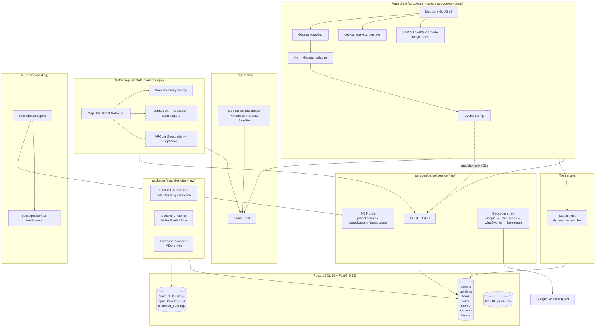

# Spatial Parcel Engine (Muzima) — SOTA 2026 Research

> **Audit date**: 2026-05-23
> **Scope**: Map rendering, parcel drawing, hierarchical metadata, satellite imagery, building extraction, 3D, geocoding, cadastre, mobile capture, realtime collab — all evaluated for BOSSNYUMBA101 multi-tenant property-management AI primarily targeting East Africa (Kenya, Tanzania, Uganda).
> **Codebase state (as audited)**: `packages/database/src/schemas/property.schema.ts` stores only point lat/long (`decimal(10,8)`, `decimal(11,8)`). No PostGIS extension enabled. No polygon, no parcel, no building/floor/unit-shape hierarchy. No `packages/spatial-engine` or `services/parcel-service` exists. Country default `KE`. Drizzle ORM. RLS-style tenant isolation enforced via `tenantId` column on every table.
> **Gap**: To ship Muzima v1, we need a brand-new spatial subsystem: PostGIS-backed storage, MapLibre + PMTiles client, drawing toolkit, building footprint enrichment from Google Open Buildings, hierarchical parcel→building→floor→unit→element data model with photos & color layers, mobile capture, and collaborative editing.

---

## Part A — Per-topic SOTA findings

### 1. Map rendering & interactivity (May 2026)

| Library / SDK | Status May 2026 | OSS? | Notable | EA fit |
|---|---|---|---|---|
| **MapLibre GL JS v5.18+ / v5.19** | Stable; v5.0 released early 2026; WebGPU on roadmap to v6 | Yes (BSD-3) | Globe, 3D terrain, custom layers, plugin ecosystem (Geoman, deck.gl, three.js, 3d-tiles-renderer) | **Best default** — zero per-load cost |
| **Mapbox GL JS v3.x** | Standard Style with 3D lighting, building shadows, ~50% load-speed gain, Globe view, 3D landmarks | No (BSL 2020) | Best polished cartography + Studio | 50k free loads/mo then $0.50/1k; EA satellite coverage decent |
| **Google Maps Platform (Photorealistic 3D Tiles + 3D Maps API)** | 49 countries / 2,500+ cities photorealistic; Enterprise SKU 1k free events | No | Best-in-class 3D in covered metros | **EA coverage thin** — Nairobi/Dar/Kampala partial; expensive |
| **deck.gl v9.1** | TypeScript rewrite; WebGPU via luma.gl 9; better MVTLayer/TerrainLayer; GPU aggregation back | Yes (MIT) | Layered viz over MapLibre/Mapbox | Excellent for analytics overlays on parcel data |
| **Cesium / Cesium ion** | Full 3D Tiles streaming; can drape WMS/TMS rasters | Apache-2 client; ion paid | Photorealistic 3D Tiles from Google included in ion (2023+) | Heavy; reserve for 3D building tours |
| **OpenLayers v10.8/10.9** | Mature; clipped-vector-tile interaction; VectorSource recommended for editing | Yes (BSD-2) | More OGC-standards-centric (WMS/WFS) | Good fallback if cadastral WMS feeds appear |
| **Esri ArcGIS Maps SDK JS v4.30 → v5.0** | 3D model upload GA, glTF export, time-aware scene layers, 2.5× faster layer-list | No | Excellent if you ingest Esri Living Atlas | EA imagery via Esri World Imagery is high quality but enterprise-priced |
| **Leaflet** | Still maintained; raster-tile focused | Yes (BSD-2) | Tiny, simple | Skip — no vector tiles, no 3D |
| **HERE Maps SDK** | Stable | No | Strong India coverage | Not a fit for EA |
| **Mapillary** (Meta) | Open-source street-level imagery, CC BY-SA; 190+ countries; AI-detected signs/road-marks | Yes/CC | Sparse but growing EA coverage | Worth ingesting; only freely-licensed street-view that crosses into EA |

**Decision for Muzima v1**: **MapLibre GL JS v5** is the base; **deck.gl v9** for heavy parcel-overlay analytics; **Cesium** as an opt-in "3D Tour" mode (only when tenant uploads photogrammetry or buys Photorealistic 3D Tile credits).

---

### 2. Polygon drawing & editing

| Tool | Status 2026 | Engines supported | Snap / measure / edit | Verdict |
|---|---|---|---|---|
| **MapLibre-Geoman (free + pro)** | Active; the most powerful 2026 drawing plugin | MapLibre + Mapbox | Draw / edit / drag / cut / rotate / split / scale / **measure / snap** / pin; markers, polylines, polygons, circles, rectangles, GeoJSON, MultiPoly | **Best choice** — covers every Muzima drawing need out of the box; Pro license affordable |
| **Mapbox GL Draw** | Mature but minimal | Mapbox + MapLibre (via adapter) | Polygon/line/point only; vertex direct-select; snapping requires `mapbox-gl-draw-snap-mode` 3rd-party | Decent fallback; ageing |
| **Terra Draw** | Active OSS by James Milner; OSGeo project | Mapbox, MapLibre, Google Maps, OpenLayers, Leaflet, ArcGIS | Modes for points/lines/polys/rectangles/circles + select mode | Excellent for engine portability if we expect to swap renderers |
| **Custom WebGL canvas** | High effort | — | — | Skip unless we need bespoke ergonomic gestures |

**Decision**: **Geoman Free** for v1; upgrade to Pro for snap-guides + L-shape/cut/rotate when complex compound parcels appear.

---

### 3. Parcel data storage

| Layer | Choice | Why |
|---|---|---|
| **Spatial DB** | **PostGIS 3.5** on the existing Postgres (PG 12–18 supported) | Single source of truth; works with current Drizzle stack & tenant-scoped RLS; supports `GEOMETRY` + `GEOGRAPHY`, GiST/R-Tree indexes, `ST_AsMVT` / `ST_AsMVTGeom` for on-the-fly tile generation, topology, 3D. |
| **Tile generator (server)** | **Martin** (Rust by Maplibre org) | Benchmarks: 2–3× faster than `pg_tileserv`, 4–70× faster than ldproxy; MVT via `ST_AsMVT`; PMTiles + MBTiles sources too. |
| **Static / cold tiles** | **PMTiles v3** on S3 + CloudFront | Serverless; ~70% smaller vectors with directory deltas; HTTP range reads; ~10–15% smaller than MBTiles; zero compute layer. |
| **Batch / analytics** | **GeoParquet 1.1** (transitional) and **Parquet native GEOMETRY/GEOGRAPHY** (the 2026 way) via `geoarrow` for in-process | GeoParquet 2.0 will drop the Arrow-extension type in favour of Parquet-native — adopt 1.1 now, plan a 2.0 migration when libs catch up. |
| **Coarse spatial index for analytics/joins** | **H3** (resolution 8–10 for parcel-scale, 11–12 for building) via the `h3-pg` PostGIS extension | Best for aggregations, "parcels near X", caching keys. Keep PostGIS GIST as truth; use H3 only as a derived bucket. |
| **SpatiaLite / on-device** | SpatiaLite in Android/iOS for offline survey | Compatible with PostGIS function names; lets us round-trip GeoJSON without a server. |

**Anti-patterns to avoid**: S2 for our use case (excellent globally but PostGIS native types are faster for our country-scoped tenancy); storing GeoJSON as raw JSONB (loses GiST acceleration); >5 decimal places of coordinate precision (25–40% wasted bytes per source).

---

### 4. Vector tiles

- **Format**: **Mapbox Vector Tiles (MVT) v2** spec — universal client support.
- **Wrapper**: **PMTiles v3** for static delivery (one file on S3 = a basemap).
- **Generation**:
  - **Dynamic per-tenant parcels** → Martin against PostGIS (`/{tenant}/parcels/{z}/{x}/{y}.mvt`, tenant param forced into RLS via `current_setting`).
  - **Cold/big basemap** → tile-join → upload PMTiles to S3 (refresh nightly).
- **Background tile sources** to choose from per zoom band:
  - z0–z6 global: **Protomaps** OSM basemap (free non-commercial; paid GitHub sponsor for commercial).
  - z7–z14 country: **Stadia Maps** vector tiles (paid, low-cost) **or** self-hosted Protomaps PMTiles built from Geofabrik Africa extract.
  - Satellite raster: **Stadia Alidade Satellite 30 cm** (Eastern South Africa, Nigeria in 2026 country mosaics; baseline 1.5 m global from SPOT) **or** **Mapbox Satellite** (10–20 cm in metros, ~30 cm rural) **or** **Esri World Imagery** (0.3 m+ where available).

---

### 5. Satellite / aerial imagery for East Africa

| Source | Resolution | License / cost | EA coverage | Refresh |
|---|---|---|---|---|
| **Sentinel-2 (Copernicus)** via Digital Earth Africa | 10 m | Free, open | **All of Africa, every 5 days** | Continuous |
| **Sentinel-2 via Google Earth Engine** | 10 m | Free **until 27 Apr 2026** — then quota-tiered (commercial = paid) — IMPORTANT | Continuous | Same |
| **Mapbox Satellite** | 10–20 cm metros, 30 cm rural | Per map-load (Maps API) | Decent EA, sparser outside Nairobi/Mombasa/Dar/Kampala | Annual-ish |
| **Esri World Imagery** | 0.3 m where available | ArcGIS subscription | Good urban EA | Annual-ish |
| **Stadia Alidade Satellite** | 30 cm in 37M km² | Tile pricing | Improving — Nigeria, Eastern South Africa country mosaics in 2026 update | — |
| **Maxar (Vantor) Open Data** | 30–50 cm | Free for disaster events; commercial otherwise | Event-driven (cyclones, conflicts) | Per event |
| **Planet Labs** | 3 m daily PlanetScope, 50 cm SkySat | Commercial; education tier | Excellent daily | Daily |
| **OpenAerialMap (HOT)** v2 STAC-backed | 10–50 cm | CC | Sparse — drone-contributed in mapped corridors | Ad hoc |
| **Google Earth Engine** | All of the above via catalog | Free non-commercial below quota, paid commercial post-April 2026 | Mixed | Continuous |

**Decision**: Free baseline = **Sentinel-2 via Digital Earth Africa** (`https://explorer.digitalearth.africa/`) for "fresh imagery" toggle; paid hi-res = **Mapbox Satellite** style as default in Muzima's "trace from satellite" mode; commercial-tier tenants can bring their own Maxar/Planet/drone uploads via OpenAerialMap-compatible STAC.

---

### 6. Building / feature extraction from imagery (the killer EA feature)

The **single biggest unlock** for BOSSNYUMBA in East Africa is that **Google Open Buildings v3** has already segmented 1.8 B building footprints across 58 M km² (Africa + S. Asia + SE Asia + LATAM + Caribbean) from Google's Ghana office.

| Source | Buildings | EA coverage | License | Update |
|---|---|---|---|---|
| **Google Open Buildings v3 (polygons)** | 1.8 B globally, **largest concentration is Africa** | All EA, even rural | CC BY-4.0 | Inferred May 2023; v3 is current |
| **Google Open Buildings 2.5 Temporal** | Time-aware building presence/absence (built 2015→present) | Africa | CC BY-4.0 | 2024 blog post; production |
| **Microsoft Global ML Building Footprints** | 1.2 B globally, **500 M+ in Africa**; +1.9 M from Maxar/Vexcel imagery between 2020 and 2025 (added Jan 2026) | All EA, weaker on dense informal settlements | ODbL | Continuous; GeoParquet 1.1 distribution |
| **VIDA combined Google+Microsoft+OSM** | Union dataset | All EA | Mixed | Periodic |
| **Overture Maps Foundation Buildings** | Built on Microsoft + Google + OSM, includes Google in 2024 | EA usable for most layers | CDLA 2.0 | Quarterly; **2026-04-15.0 is latest** |
| **OSM Buildings** (Geofabrik) | Variable | EA: <20% completeness in 9k cities (48% of urban pop); >80% in 1.8k cities | ODbL | Continuous |

**Custom segmentation (when prebuilt footprints miss informal settlements)**:

| Model | Status | Use |
|---|---|---|
| **SAM 2.1** (Meta Segment Anything 2.1) | Zero-shot; YOLO-E + SAM2 hybrid published 2025 for disaster building extraction | "Click a building on the satellite, get a clean polygon" — *the* feature for hand-tracing in EA where Open Buildings missed huts |
| **SAM4Refugee** | SAM-adapter fine-tuned on refugee-camp imagery | Reference for our fine-tune |
| **Florence-2** (Microsoft) | Grounded segmentation | Useful for "find all buildings + boundary walls in this image" |
| **Mask R-CNN / U-Net** | Classical | Skip — SAM 2 is strictly better in 2026 |

**Decision for Muzima v1**:
1. Pre-load **Overture Buildings 2026-04-15** for KE/TZ/UG into PostGIS (one row per building, H3 r12 indexed, source provenance preserved).
2. UI: user drops a pin → snap to nearest Open Buildings polygon (Hausdorff distance < 5 m) → user accepts/edits.
3. "Magic-trace" mode: open SAM 2.1 in browser (WebGPU; Meta released ONNX/TFJS variants) → user clicks the roof → polygon returned → editable.

---

### 7. 3D buildings & terrain

| Tech | Use case | EA coverage / cost |
|---|---|---|
| **Google Photorealistic 3D Tiles** | High-end "city tour" mode | Limited EA — only major metros; ~$0.10/event Enterprise SKU. Defer to v2. |
| **Cesium ion + 3D Tiles** | Stream user-uploaded photogrammetry or Google PR3DT | Free tier + paid; CesiumJS / native; pairs with MapLibre via three.js plugin (no native MapLibre support yet, only flat-terrain integration). |
| **DroneDeploy / Pix4D** | Tenant-uploaded drone-flight to 3D mesh | Tenant brings their license; we ingest glTF / 3D Tiles. |
| **RealityCapture** (Epic) | Photogrammetry from phone bursts | Free tier 2024+. Optional. |
| **3D Gaussian Splatting** — **Luma AI** (free, mobile, best consumer quality), **Polycam Pro** ($150/yr, mobile + AEC + floor plans), **PostShot** (desktop, on-prem, privacy-safe) | "Walk through this apartment / show this plot from above" tours | **Highest leverage for property listings** — phone capture only, no special hardware. |

**Decision for Muzima v1**: **3D Gaussian Splatting via Luma AI** as the "Property 3D Tour" capture path (mobile only) — embed `.splat` files on the property page; Cesium / Photorealistic 3D Tiles defer to v2.

---

### 8. Address & geocoding for EA

| Provider | Coverage EA | Pricing | Note |
|---|---|---|---|
| **Google Maps Geocoding** | Best EA POI coverage; weak on informal addresses | Per-request | Default for "find this address" |
| **Mapbox Geocoding v5/v6** | OSM-backed; coverage depends on local OSM; Standard tier for KE/TZ/UG | 100k free/mo then per-request | Decent fallback |
| **Plus Codes (Open Location Code)** | Google-deployed in Kisumu, Mbale, Maseno, Majengo, Chavakali (KE); Vihiga; Nigeria | Free, open | **Use as primary fallback for Tanzania/Uganda rural** |
| **what3words** | Used by Kenya government; sparse outside major cities | Commercial license | Brand-recognized in KE — keep as input option |
| **OpenStreetMap Nominatim** (or Pelias from Stadia) | Free; coverage uneven | Free / Stadia paid | Self-host for cost control |
| **OpenCage** | Wraps multiple sources | Per-request | Useful aggregator |

**Decision**: Layered geocoder service in `services/parcel-service`:
1. Try Google Geocoding (paid).
2. Fall back to Plus Code lookup (free, official Google library).
3. Accept what3words as a typed input (convert via API).
4. Always *also* store a Plus Code in the parcel row — universal portable address.

---

### 9. Cadastral & official boundaries (EA)

| Country | System | Status | API? |
|---|---|---|---|
| **Kenya** | **Ardhi Sasa** (front-end) / **NLIMS** (back-end Cadastral DB) | Production; partial title coverage; central-government-only consumer access | **No public/developer API as of May 2026.** Manual lookup only. |
| **Tanzania** | **ILMIS** (Integrated Land Management Information System), IGNFI-built | Production; manages titles, surveys | **No public API**; bilateral integrations only |
| **Uganda** | **UgNLIS** | Operational; spatial registration platform | **No public API**; MoU-only access |
| **Open data fallback** | OpenStreetMap admin boundaries + Overture Maps Administrative theme | Free; CDLA 2.0 / ODbL | Yes — daily Geofabrik dumps |

**Decision**: Build the system **assuming no machine-readable cadastre**. User-traced polygons are first-class; if/when KE/TZ/UG open APIs, we add an `authoritative_source` enum to the parcel table (`USER_TRACED | KE_NLIMS | TZ_ILMIS | UG_UGNLIS | OSM | OVERTURE | OPEN_BUILDINGS_GOOGLE`).

---

### 10. Rich parcel metadata model (the hierarchy)

The data model needs to express:

```
Parcel (the legal plot)
 ├── Boundary (Polygon, color-coded, source-tagged)
 ├── Buildings[] (Polygon per building)
 │    ├── Floors[] (z-stack, count, height)
 │    │    └── Units[] (Polygon in floor frame OR 3D extrusion)
 │    │         └── Rooms[] (Polygon in unit frame)
 │    │              └── Elements[] (Walls, doors, windows, fixtures)
 │    └── Building-Elements[] (External walls, roof)
 ├── Site-Elements[] (Fences, gates, garages, water tanks, septic, paths)
 ├── Pins[] (POIs: meter, mailbox, security post, parking spot)
 └── Layers[] (user-defined: "Maintenance zones", "Tenant zones", "Power grid")
```

Each node carries:
- `id` UUID, `tenant_id`, `parent_id`, `kind`
- `geometry` PostGIS (Polygon/MultiPolygon/Point/LineString)
- `geometry_3d` PolyhedralSurface when 3D
- `color` (CSS hex, layer-overridable)
- `attributes` JSONB (free-form)
- `photos[]` (S3 keys + EXIF GPS for verification)
- `provenance` (source, traced_by, traced_at, accuracy_m)
- `time_series` linked: lease history per unit, maintenance log per element

---

### 11. Mobile capture (walk-the-boundary)

| Tech | Use |
|---|---|
| **Expo + react-native-maps OR @maplibre/maplibre-react-native** | Recommended in 2026 — open-source, identical pre-divergence Mapbox API, any tile source, no Mapbox account |
| **Phone GPS + accelerometer + Kalman filter** | Walk-the-boundary mode; record `Point[]` with HDOP, snap to polygon at end |
| **ARCore Geospatial API** (Android) | Free — Live View accuracy; sub-meter horizontal where Visual Positioning is anchored |
| **Niantic Lightship VPS (8th Wall)** | Web-AR + native; 600k VPS-activated locations globally — EA sparse |
| **Polycam / Luma AI capture in-app** | 3D capture path |

**Decision**: BOSSNYUMBA's existing `apps/estate-manager-app` and `apps/customer-app` get a new `survey-mode` screen using **@maplibre/maplibre-react-native** + **Expo Location** with foreground tracking, snapped to nearest Overture/Open Buildings polygon on save. ARCore Geospatial only when accuracy < 0.5 m is required (rare in EA today).

---

### 12. Realtime collaboration on the map

| Tech | Fit |
|---|---|
| **Yjs (CRDT)** | Battle-tested; fastest CRDT; ecosystem for shared Map/Array types — GeoJSON Feature is a `Y.Map` with `geometry` and `properties`, vertices in a `Y.Array` |
| **Liveblocks Yjs** | Hosted Yjs with auth, presence, history — matches our SaaS model |
| **Automerge** | Heavier; document-oriented; better for offline-first; choose only if disconnect-and-reconcile is the dominant mode |
| **MapLibre/Mapbox + Yjs binding** | No off-the-shelf binding — need ~300 LOC adapter that observes Geoman → Yjs and inverse |

**Decision**: **Yjs** in `packages/realtime-rooms` (already exists in the monorepo) extended with a `parcel-room` provider; **Liveblocks Yjs** as the SaaS sync engine (avoid building our own y-websocket scaler). Presence cursors via Liveblocks.

---

## Part B — Reference architecture



**Why this shape**
- All tenant data lives in PostGIS — *one* source of truth, *one* RLS boundary, *one* backup story.
- Martin renders MVTs from PostGIS on demand with `tenant_id` baked into the SQL function — RLS prevents cross-tenant leak.
- PMTiles + CloudFront serve the giant *static* basemap (OSM, satellite) at near-zero compute cost.
- Liveblocks Yjs is the **only piece** we don't run ourselves; everything else is in-cluster.
- MCP exposure means the AI copilot can `parcel.search("plots with rent overdue near …")` natively.

---

## Part C — Data model (SQL sketch)

```sql
-- Enable PostGIS, h3, h3_postgis
CREATE EXTENSION IF NOT EXISTS postgis;
CREATE EXTENSION IF NOT EXISTS h3;
CREATE EXTENSION IF NOT EXISTS h3_postgis;

-- Parcels (the legal plot)
CREATE TABLE parcels (
  id           uuid PRIMARY KEY DEFAULT gen_random_uuid(),
  tenant_id    uuid NOT NULL,
  property_id  uuid REFERENCES properties(id) ON DELETE SET NULL, -- bridge to existing schema
  parcel_code  text,                       -- e.g. LR No / Plot No
  jurisdiction text NOT NULL,              -- "KE-NAIROBI", "TZ-DAR" — never hard-code, use region-config
  boundary     geometry(MultiPolygon, 4326) NOT NULL,
  area_sqm     double precision GENERATED ALWAYS AS (ST_Area(boundary::geography)) STORED,
  centroid     geometry(Point, 4326)      GENERATED ALWAYS AS (ST_Centroid(boundary)) STORED,
  h3_r10       h3index                    GENERATED ALWAYS AS (h3_lat_lng_to_cell(centroid, 10)) STORED,
  plus_code    text,                       -- Open Location Code, always populated
  authoritative_source text NOT NULL DEFAULT 'USER_TRACED'
      CHECK (authoritative_source IN
        ('USER_TRACED','KE_NLIMS','TZ_ILMIS','UG_UGNLIS','OSM','OVERTURE','OPEN_BUILDINGS_GOOGLE','MICROSOFT_BUILDINGS')),
  accuracy_m   numeric,                    -- e.g. 5.0 for hand-traced from satellite
  color        text DEFAULT '#3b82f6',
  attributes   jsonb NOT NULL DEFAULT '{}'::jsonb,
  traced_by    uuid REFERENCES users(id),
  traced_at    timestamptz,
  created_at   timestamptz NOT NULL DEFAULT now(),
  updated_at   timestamptz NOT NULL DEFAULT now(),
  deleted_at   timestamptz
);
CREATE INDEX parcels_tenant_idx ON parcels (tenant_id) WHERE deleted_at IS NULL;
CREATE INDEX parcels_boundary_gix ON parcels USING GIST (boundary);
CREATE INDEX parcels_h3_idx ON parcels (h3_r10);
-- RLS:
ALTER TABLE parcels ENABLE ROW LEVEL SECURITY;
CREATE POLICY parcels_tenant_isolation ON parcels
  USING (tenant_id = current_setting('app.current_tenant')::uuid);

-- Buildings, floors, units, rooms, elements — all follow the same pattern
CREATE TABLE buildings (
  id              uuid PRIMARY KEY DEFAULT gen_random_uuid(),
  tenant_id       uuid NOT NULL,
  parcel_id       uuid NOT NULL REFERENCES parcels(id) ON DELETE CASCADE,
  building_code   text,
  footprint       geometry(Polygon, 4326) NOT NULL,
  height_m        numeric,
  floors_count    int,
  roof_type       text,
  external_color  text DEFAULT '#94a3b8',
  attributes      jsonb NOT NULL DEFAULT '{}'::jsonb,
  source          text NOT NULL DEFAULT 'USER_TRACED',
  created_at      timestamptz NOT NULL DEFAULT now()
);
CREATE INDEX buildings_footprint_gix ON buildings USING GIST (footprint);
CREATE INDEX buildings_parcel_idx ON buildings (tenant_id, parcel_id);

CREATE TABLE floors (
  id           uuid PRIMARY KEY DEFAULT gen_random_uuid(),
  tenant_id    uuid NOT NULL,
  building_id  uuid NOT NULL REFERENCES buildings(id) ON DELETE CASCADE,
  level        int NOT NULL,                       -- -1 basement, 0 ground, 1 first…
  height_m     numeric,
  floorplan    geometry(Polygon, 4326),            -- usually = building footprint at level
  attributes   jsonb NOT NULL DEFAULT '{}'::jsonb,
  UNIQUE (building_id, level)
);

CREATE TABLE parcel_units (                          -- decoupled from existing `units` table
  id             uuid PRIMARY KEY DEFAULT gen_random_uuid(),
  tenant_id      uuid NOT NULL,
  floor_id       uuid NOT NULL REFERENCES floors(id) ON DELETE CASCADE,
  unit_id        uuid REFERENCES units(id),         -- bridge to existing leasable-units table
  unit_polygon   geometry(Polygon, 4326),           -- in floor frame
  color          text DEFAULT '#22c55e',
  attributes     jsonb NOT NULL DEFAULT '{}'::jsonb
);

CREATE TABLE rooms (
  id         uuid PRIMARY KEY DEFAULT gen_random_uuid(),
  tenant_id  uuid NOT NULL,
  unit_id    uuid NOT NULL REFERENCES parcel_units(id) ON DELETE CASCADE,
  kind       text NOT NULL,                          -- bedroom | bathroom | kitchen | living | …
  shape      geometry(Polygon, 4326),
  attributes jsonb NOT NULL DEFAULT '{}'::jsonb
);

CREATE TABLE elements (                              -- walls, doors, fences, gates, garages, meters
  id            uuid PRIMARY KEY DEFAULT gen_random_uuid(),
  tenant_id     uuid NOT NULL,
  parent_kind   text NOT NULL CHECK (parent_kind IN ('parcel','building','floor','unit','room')),
  parent_id     uuid NOT NULL,
  kind          text NOT NULL,                       -- wall | door | fence | gate | garage | meter | tank | septic | path
  geom          geometry NOT NULL,                   -- mixed Point/Line/Polygon
  color         text,
  attributes    jsonb NOT NULL DEFAULT '{}'::jsonb,
  CONSTRAINT elements_geom_type CHECK (
    GeometryType(geom) IN ('POINT','LINESTRING','POLYGON','MULTILINESTRING','MULTIPOLYGON'))
);
CREATE INDEX elements_geom_gix ON elements USING GIST (geom);
CREATE INDEX elements_parent_idx ON elements (tenant_id, parent_kind, parent_id);

CREATE TABLE map_layers (                            -- user-defined coloured overlays
  id          uuid PRIMARY KEY DEFAULT gen_random_uuid(),
  tenant_id   uuid NOT NULL,
  name        text NOT NULL,
  color       text NOT NULL,
  filter      jsonb,                                 -- e.g. {"unit.status":"vacant"}
  z_index     int DEFAULT 0
);

CREATE TABLE element_photos (
  id          uuid PRIMARY KEY DEFAULT gen_random_uuid(),
  tenant_id   uuid NOT NULL,
  element_id  uuid NOT NULL REFERENCES elements(id) ON DELETE CASCADE,
  s3_key      text NOT NULL,
  taken_at    timestamptz,
  exif_geom   geometry(Point, 4326)                 -- for "is this photo really at this element?" sanity-check
);

-- Reference imports (read-only, refreshed nightly)
CREATE TABLE ref_overture_buildings (
  id         text PRIMARY KEY,
  country    text NOT NULL,
  footprint  geometry(Polygon, 4326) NOT NULL,
  height_m   numeric,
  source     text,
  release    text NOT NULL
);
CREATE INDEX ref_overture_gix ON ref_overture_buildings USING GIST (footprint);

CREATE TABLE ref_google_open_buildings (
  id              text PRIMARY KEY,
  country         text NOT NULL,
  footprint       geometry(Polygon, 4326) NOT NULL,
  confidence      numeric,
  full_plus_code  text
);
CREATE INDEX ref_gob_gix ON ref_google_open_buildings USING GIST (footprint);
```

---

## Part D — Vendor decision matrix

### D.1 Renderer

|  | MapLibre GL v5 | Mapbox GL v3 | Google Maps Photorealistic 3D | Cesium ion |
|---|:-:|:-:|:-:|:-:|
| **Cost at 1M map-loads/mo** | $0 + tile bandwidth | ~$475 | ~$1k+ for 3D tiles | $$ |
| **2D vector tiles** | Yes | Yes | No | Limited |
| **3D buildings/terrain** | Plugins (three.js, 3d-tiles-renderer) | Native + Standard Style | Native, best-in-class | Native, best for streamed 3D |
| **EA satellite quality** | BYO (Mapbox, Stadia, Esri) | Mapbox Satellite (decent) | Photorealistic 3D thin EA | Drape your own |
| **License** | BSD-3 — full self-host | Proprietary | Proprietary | Apache-2 client / paid ion |
| **Mobile** | Native via `@maplibre/maplibre-react-native` | Mapbox SDK (paid MAU) | Limited | Cesium native iOS/Android |
| **Verdict** | **WIN v1** | Reserve for "premium" tenant tier | v2 city-tour mode | v2 high-end |

### D.2 Tile storage / serving

|  | PMTiles + S3 + CloudFront | Martin + PostGIS | pg_tileserv | Tegola | MBTiles + tileserver-gl |
|---|:-:|:-:|:-:|:-:|:-:|
| **Static basemap** | **WIN** | — | — | — | Heavy |
| **Dynamic tenant data** | — | **WIN (2–3× faster)** | OK | OK | OK |
| **Serverless** | Yes | No | No | No | No |
| **Verdict** | Both: **PMTiles** for cold, **Martin** for live |

### D.3 Building footprint source

|  | Google Open Buildings v3 | Microsoft Global ML | Overture (union) | VIDA combined | OSM | SAM 2.1 on-the-fly |
|---|:-:|:-:|:-:|:-:|:-:|:-:|
| **EA coverage** | 1.8B inc. dense rural | 500M+ Africa | Union of above | Union | Patchy | Anywhere with imagery |
| **License** | CC BY-4.0 | ODbL | CDLA 2.0 | Mixed | ODbL | Generated locally |
| **Refresh** | 2023 inferred | Continuous (Jan 2026 +1.9M) | Quarterly | Periodic | Continuous | Real time |
| **Verdict** | **Default for rural EA** | **Default for urban EA** | **Bulk import primary** | Useful for QA | Last resort | "Magic-trace" for gaps |

### D.4 Realtime collab

|  | Yjs + Liveblocks | Yjs + self-host y-websocket | Automerge | Just REST + polling |
|---|:-:|:-:|:-:|:-:|
| **Latency** | <100 ms | <100 ms | <500 ms (sync-heavy) | seconds |
| **Ops burden** | None (SaaS) | Medium | High | Low |
| **Offline merge** | Good | Good | **Best** | Bad |
| **Verdict** | **v1** | v2 cost cut | Niche (heavy offline crews) | Skip |

---

## Part E — 10 concrete things to build to ship Muzima v1

Ordered so each unlocks the next; can be parallelised in pairs (1+2, 3+4, 5+6, …).

1. **`packages/spatial-engine`** — TypeScript package
   - GeoJSON ↔ PostGIS WKT/EWKT converters
   - Coordinate-precision normaliser (5 dp default)
   - H3 cell helpers (`h3-js` + `h3-pg` SQL helpers)
   - Plus Code encode/decode (`open-location-code` npm)
   - Polygon ops via Turf.js: area, centroid, simplify, union, difference, validate (no self-intersection)
   - Validation Zod schemas for Parcel, Building, Floor, Unit, Room, Element

2. **PostGIS migration + RLS** — `packages/database/drizzle/0003_spatial_parcels.sql`
   - `CREATE EXTENSION postgis, h3, h3_postgis`
   - All tables from Part C with RLS via `app.current_tenant` setting
   - GIST indexes everywhere
   - `parcel_mvt(z int, x int, y int, tenant uuid)` SQL function returning `bytea` for Martin

3. **`services/parcel-service`** — new service in `services/`
   - REST/tRPC: `POST /parcels`, `GET /parcels?bbox=…`, `PATCH /parcels/:id`, `POST /parcels/:id/buildings`, …
   - Geocoder chain (Google → Plus Codes → what3words → Nominatim)
   - "Snap-to-nearest-building" endpoint that takes a `Point` and queries Overture + Google Open Buildings within 25 m, returns top 3 candidate polygons + confidence
   - **MCP server** wrapper that exposes these as tools to the AI copilot (`parcel.search_by_address`, `parcel.trace_from_satellite`, `parcel.list_in_bbox`, `parcel.upsert_building`)
   - Tenant-context middleware that calls `SET LOCAL app.current_tenant = $tenantId`

4. **Reference-data ingest jobs** — `services/consolidation-worker` (existing) gets a new pipeline
   - Nightly: Geofabrik Africa OSM extract → `ref_overture_buildings` filter
   - Weekly: Overture 2026-04-15.0 → upsert by `id`
   - One-shot: Google Open Buildings v3 KE/TZ/UG bulk import (~30 GB)
   - One-shot: Microsoft GlobalMLBuildingFootprints KE/TZ/UG (~10 GB)
   - All as GeoParquet → COPY into PostGIS

5. **Martin tile server** — `infra/martin/` (Docker)
   - Config exposes `/{tenant}/parcels/{z}/{x}/{y}.mvt` and `/{tenant}/buildings/{z}/{x}/{y}.mvt`
   - JWT-validated query params; SQL function injects tenant_id
   - Behind CloudFront with `Cache-Control: private, max-age=60`

6. **Web map UI** — `packages/spotlight` (existing canvas/chat shell) gets a `<ParcelMap/>` component
   - MapLibre GL JS v5 + MapLibre-Geoman Free
   - Layers: PMTiles basemap (Protomaps), satellite raster toggle (Mapbox Satellite or Stadia), dynamic parcels MVT from Martin, deck.gl analytics overlay
   - Drawing modes: Polygon (parcel boundary), Polygon (building), Polygon (room), Point (pin: meter/gate/tap), LineString (fence/wall)
   - "Magic-trace" button: load SAM 2.1 small model in WebGPU, user clicks roof → polygon
   - Snap-to-nearest-reference-building when drawing
   - Color picker per layer; layer manager sidebar
   - Photo upload per element (S3 presigned + EXIF GPS verification)
   - **Yjs + Liveblocks** integration: presence cursors + concurrent draw

7. **Mobile capture** — `apps/estate-manager-app` (Expo)
   - `@maplibre/maplibre-react-native` map with the same Martin tile URLs
   - `expo-location` foreground tracking for "walk-the-boundary" mode
   - Photo capture with EXIF GPS preserved
   - Optional `react-native-luma-ai` (if SDK available) for 3D Gaussian Splat tours
   - SyncQueue for offline-first: queued edits to parcel-service when offline

8. **AI copilot tools** — `packages/ai-copilot` MCP wiring
   - `parcel.list_by_address("Plot 42 Westlands, Nairobi")` → geocode → bbox query → return GeoJSON
   - `parcel.summarise(parcel_id)` → joins units / leases / payments / maintenance for the LLM
   - `parcel.detect_buildings_from_satellite(parcel_id)` → calls SAM 2.1 server-side using Mapbox Satellite raster for the parcel bbox → returns candidate building polygons + confidence
   - `parcel.trace_boundary(plus_code | what3words | address)` → geocode → suggest polygon from Overture admin boundaries

9. **Imagery service** — small new microservice or `packages/spatial-engine/imagery/`
   - Sentinel-2 fetcher (Digital Earth Africa STAC; cached to S3)
   - Mapbox Static API wrapper (signed URLs, per-tenant quota)
   - Returns a PNG tile or COG (Cloud-Optimized GeoTIFF) for any parcel bbox/date
   - **Heads-up**: Google Earth Engine quota tiers go into effect 27 April 2026 — if commercial GEE used, must enrol in paid tier

10. **Realtime room** — extend `packages/realtime-rooms` (existing)
    - Add `parcel-room` provider over Liveblocks Yjs
    - Map each `Parcel` to a Liveblocks room id `parcel:{tenant}:{parcel_id}`
    - Bind Geoman drawing events → Y.Doc; bind Y.Doc → Geoman re-render
    - Persistence: every 30 s snapshot to PostGIS; full history retained in Liveblocks

---

## Part F — Cost & licensing cheat sheet (May 2026)

| Component | Cost class | Note |
|---|---|---|
| MapLibre GL JS v5 | **Free** | BSD-3 |
| Geoman Free | Free | MIT |
| Geoman Pro | Low ($) | Per-domain |
| PMTiles | Free (just storage/CDN) | BSD-3 |
| Protomaps OSM basemap | Free non-commercial; **GitHub Sponsor required commercial** | — |
| Stadia Maps tiles + Alidade Satellite | Low-mid ($) | Generous free tier; 30 cm satellite added 2026 |
| Mapbox satellite + GL v3 + geocoding | Mid ($$) | 50k free map-loads, 100k free geocodes/mo |
| Google Maps (Geocoding + Photorealistic 3D Tiles) | High ($$$) | Photorealistic 3D ~$0.10/event Enterprise SKU |
| PostGIS + Martin | **Free** | Compute only |
| Google Open Buildings v3 | **Free** (CC BY-4.0) | Bulk download from Earth Engine catalog or Source.coop |
| Microsoft Global ML Buildings | **Free** (ODbL) | GeoParquet on Source.coop |
| Overture Maps | **Free** (CDLA 2.0) | AWS Registry of Open Data |
| Liveblocks Yjs | Mid ($$) | Per-MAU; generous free tier |
| Luma AI | **Free** consumer tier | Pro = $$ |
| Polycam Pro | $150/yr | Per user |
| ARCore Geospatial | **Free** | Google quota applies |
| Earth Engine | Free non-comm → **quota tiers from 27 Apr 2026** | Plan for paid commercial tier |

---

## Part G — Risks & mitigations

| Risk | Mitigation |
|---|---|
| **No cadastral API in EA** → all polygons are user-traced and unauthoritative | First-class `authoritative_source` + `accuracy_m` columns; UI shows provenance badge; never assert legal ownership in copy |
| **Google Earth Engine paywall April 2026** | Default to Digital Earth Africa Sentinel-2 STAC (free); use GEE only via paid tier when chosen by tenant |
| **Mapbox proprietary BSL** since Dec 2020 | Build on MapLibre; Mapbox is **opt-in** tile/raster source only — never bake the SDK |
| **Photo PII / EXIF GPS leakage** | Strip EXIF except GPS-for-verification (keep only on server, never expose in public photos) |
| **Polygon self-intersection / invalid geometry** | `ST_IsValid` + `ST_MakeValid` on every write; Zod + Turf double-check client-side |
| **Cross-tenant leak via Martin tiles** | SQL function `parcel_mvt` does `WHERE tenant_id = current_setting('app.current_tenant')` — and Martin JWT validates the tenant claim |
| **Liveblocks vendor lock-in** | Yjs Y.Doc is portable; can swap to self-hosted y-websocket without data migration |
| **Africa OSM completeness gaps** | Layer Microsoft + Google + OSM via VIDA union; user manual trace is always the override |
| **PostGIS migration cost on existing DB** | New tables only; existing `properties` table gets a nullable `parcel_id` FK; zero changes to existing rows |
| **Phone GPS accuracy in dense urban canyons** | Kalman-filter + post-walk snap to nearest reference polygon; mark accuracy_m honestly |

---

## Part H — Naming convention for the package

Recommendation: keep both
- `packages/spatial-engine` — *pure logic*: validators, converters, H3, Plus Codes, Turf wrappers, Zod schemas, MCP tool definitions. No I/O.
- `services/parcel-service` — *I/O*: REST/tRPC + Martin + PostGIS + geocoder chain + reference-data ingest.

This mirrors the existing `packages/payments-ledger` (logic) vs `services/payments` (I/O) split.

---

## Appendix — Sources consulted

- Mapbox GL JS v3 features & pricing — [Mapbox GL JS docs](https://docs.mapbox.com/mapbox-gl-js/), [v3.0.0 release](https://github.com/mapbox/mapbox-gl-js/releases/tag/v3.0.0), [Pricing](https://www.mapbox.com/pricing)
- MapLibre GL JS v5 — [MapLibre](https://maplibre.org/projects/gl-js/), [v5.0.0 release](https://github.com/maplibre/maplibre-gl-js/releases/tag/v5.0.0), [Newsletter Feb 2026](https://maplibre.org/news/2026-03-03-maplibre-newsletter-february-2026/)
- Google Maps Photorealistic 3D Tiles — [Tile API overview](https://developers.google.com/maps/documentation/tile/3d-tiles), [Pricing](https://mapsplatform.google.com/pricing/), [Cesium integration](https://cesium.com/learn/photorealistic-3d-tiles-learn/)
- Protomaps PMTiles v3 — [PMTiles repo](https://github.com/protomaps/PMTiles), [V3 spec changes](https://protomaps.com/blog/pmtiles-v3-whats-new/), [Cloud-native geospatial guide](https://guide.cloudnativegeo.org/pmtiles/intro.html)
- deck.gl v9 — [OpenJSF announcement](https://openjsf.org/blog/deckgl-v9), [What's new](https://github.com/visgl/deck.gl/blob/9.1-release/docs/whats-new.md)
- PostGIS 3.5 + MVT — [Crunchy Data MVT blog](https://www.crunchydata.com/blog/dynamic-vector-tiles-from-postgis), [PostGIS 3.5 docs](https://postgis.net/docs/manual-3.5/postgis-en.html)
- Drawing tools — [MapLibre-Geoman](https://github.com/geoman-io/maplibre-geoman), [Geoman docs](https://geoman.io/docs/maplibre/configuring-geoman), [terra-draw](https://github.com/JamesLMilner/terra-draw), [mapbox-gl-draw](https://github.com/mapbox/mapbox-gl-draw)
- Google Open Buildings v3 — [Research portal](https://sites.research.google/gr/open-buildings/), [Earth Engine catalog](https://developers.google.com/earth-engine/datasets/catalog/GOOGLE_Research_open-buildings_v3_polygons), [VIDA combined](https://source.coop/vida/google-microsoft-osm-open-buildings)
- Microsoft Global ML Building Footprints — [GitHub](https://github.com/microsoft/globalmlbuildingfootprints), [Source.coop GeoParquet](https://source.coop/hdx/microsoft-open-buildings/), [comparison study](https://www.sciencedirect.com/science/article/pii/S0198971524000334)
- Overture Maps Foundation — [Home](https://overturemaps.org/), [Docs](https://docs.overturemaps.org/), [AWS Registry](https://registry.opendata.aws/overture/)
- SAM 2.1 building extraction — [SAM4Refugee paper](https://arxiv.org/pdf/2407.11381), [YOLO-E + SAM2 hybrid 2025](https://www.ncbi.nlm.nih.gov/pmc/articles/PMC12299807/)
- pg_tileserv / Martin / Tegola benchmark — [Sparkgeo / Rechsteiner benchmarks](https://github.com/FabianRechsteiner/vector-tiles-benchmark), [Spatialists 2026 fast-tiles](https://spatialists.ch/posts/2025/04/05-serving-vector-tiles-fast/)
- EA land registries — [Hidden struggles of EA land digitisation](https://indepthresearch.org/blog/hidden-struggles-land-digitization-east-africa/), [Ardhi Sasa launch](https://allafrica.com/stories/202104290076.html), [ILMIS overview](https://danvastgroup.com/blog/How-the-ILMIS-Project-Facilitates-Getting-a-Land-Title-in-Tanzania), [UgNLIS](https://mlhud.go.ug/ugnlis/)
- Plus Codes EA deployments — [Kisumu rollout](https://allafrica.com/stories/202205180456.html), [Plus Codes Learn](https://maps.google.com/pluscodes/learn/)
- ARCore Geospatial + Niantic Lightship — [8th Wall Lightship VPS](https://www.8thwall.com/blog/post/85704231306/introducing-lightship-vps-for-web), [ARCore Geospatial article](https://www.fastcompany.com/90751017/google-launches-ar-world-mapping-api-putting-it-in-competition-with-niantic)
- Yjs / Liveblocks / Automerge — [Yjs](https://github.com/yjs/yjs), [Liveblocks Yjs sync engine](https://liveblocks.io/docs/collaboration-features/multiplayer/sync-engine/liveblocks-yjs)
- 3D Gaussian Splatting — [Future3D 2026 tools comparison](https://www.thefuture3d.com/blog/gaussian-splatting-software-tools-compared-2026), [Luma AI 2026 review](https://www.thefuture3d.com/software/luma-ai/), [Splatlabs virtual tours](https://www.splatlabs.ai/blog/virtual-tours-real-estate-gaussian-splatting)
- GeoArrow / GeoParquet — [Parquet native geospatial 2026](https://parquet.apache.org/blog/2026/02/13/native-geospatial-types-in-apache-parquet/), [GeoParquet 1.1 release](https://geoparquet.org/releases/v1.1.0/), [CNG transition blog](https://cloudnativegeo.org/blog/2025/10/geoparquet-parquet-geospatial-types-a-time-of-transition/)
- Satellite imagery EA — [Mapbox imagery](https://www.mapbox.com/imagery), [Stadia 2026 satellite update](https://stadiamaps.com/blog/2026-satellite-imagery-update/), [Sentinel Digital Earth Africa](https://www.digitalearthafrica.org/products-and-services/datasets/sentinel)
- Cesium 3D / MapLibre integration — [3D Tiles in MapLibre discussion](https://community.cesium.com/t/3d-tiles-in-maplibre/45683), [Cesium 2026 guide](https://www.thefuture3d.com/software/cesium/)
- H3/S2/PostGIS indexing — [Matt Forrest DGGS guide](https://forrest.nyc/discrete-global-grid-systems-h3-s2-vs-lat-long/), [Spatialists H3+PostGIS hands-on Feb 2026](https://spatialists.ch/posts/2026/02/27-h3-postgis-hands-on-example/)
- IMDF / IndoorGML 2.0 — [OGC IndoorGML 2.0 announcement](https://www.ogc.org/announcement/ogc-publishes-indoorgml-2-0-part-1-conceptual-model-standard/), [Volpis 2026 indoor maps guide](https://volpis.com/blog/how-to-create-indoor-maps/)
- Mobile maps RN 2026 — [PkgPulse 2026 comparison](https://www.pkgpulse.com/blog/react-native-maps-vs-mapbox-rn-vs-maplibre-rn-mobile-maps-2026), [MapLibre RN](https://maplibre.org/maplibre-react-native/)
- ESA Sentinel-2 in Africa via DEA — [Digital Earth Africa Sentinel](https://www.digitalearthafrica.org/products-and-services/datasets/sentinel)
- Mapillary EA — [Open data](https://www.mapillary.com/open-data), [African road-surface dataset 2025](https://www.nature.com/articles/s41597-025-05153-y)
- Multi-tenant PostGIS + RLS — [AWS Prescriptive Guidance](https://docs.aws.amazon.com/prescriptive-guidance/latest/saas-multitenant-managed-postgresql/welcome.html), [Citus multi-tenant](https://www.citusdata.com/use-cases/multi-tenant-apps/)
- GeoJSON parcel best practice — [Open Innovations optimising GeoJSON](https://open-innovations.org/blog/2023-07-25-tips-for-optimising-geojson-files)
